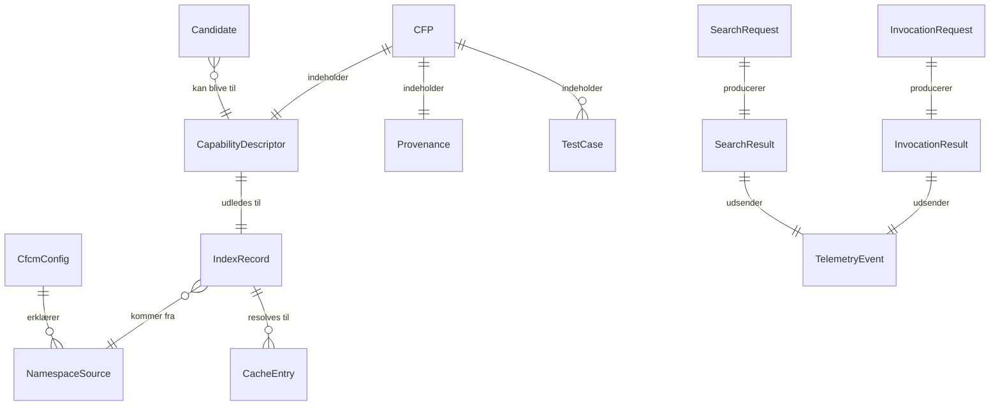
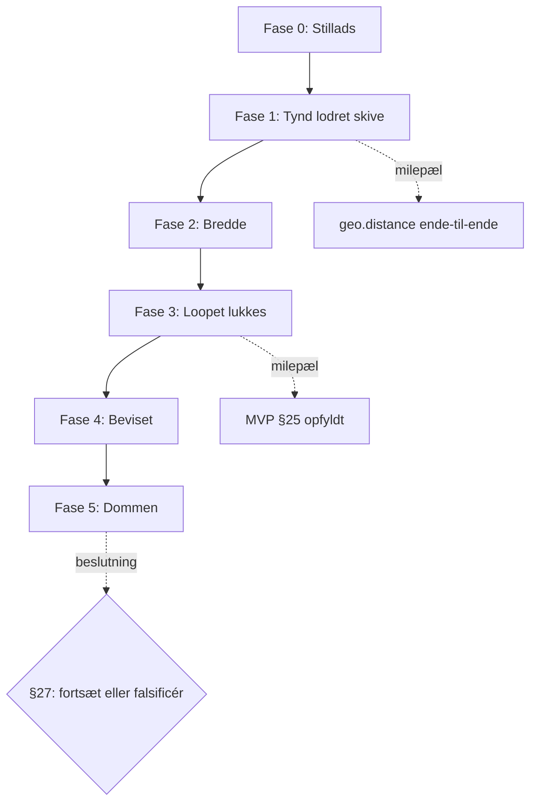

# CapFoundry MVP — Implementeringsplan (PRD)

**Version 1.0** · **Sidst opdateret: 2026-09-12** · **Status: klar til implementering**

Dette dokument omsætter [MVP v0.2](docs/mvp/CapFoundry-MVP-v0.2.md) til en plan der kan kodes efter. Det tilføjer ingen ambition til MVP'en — det lukker de huller der forhindrede den i at blive bygget, og det respekterer §5 (hvad vi bevidst ikke bygger), §27 (fejlreglen) og §28 (whiteboard-reglen) som bindende begrænsninger.

**Kildehierarki:** MVP v0.2 er normativ. [Vision & Architecture v0.5](docs/vision/CapFoundry-Vision-Architecture-v0.5.md) bruges kun til at afgøre tvivl, aldrig til at udvide scope.

---

## Arkitekturbeslutninger truffet i denne plan

MVP v0.2 lod syv ting stå åbne. De er nu afgjort:

| # | Åbent i MVP v0.2 | Beslutning | Konsekvens |
|---|---|---|---|
| AD-1 | §18: agentens kanal til CFCM | **Lokal MCP-server** | Skill'en bliver politik, ikke kaldeinstruktioner. A/B-kontrolgruppen er samme agent uden serveren tilsluttet |
| AD-2 | §12: søgealgoritme | **Leksikalsk BM25 + IDF-dækning** | Nul afhængigheder, deterministisk. Vi *måler* om semantik er nødvendig i stedet for at antage det |
| AD-3 | §13: eksekveringssandbox | **Deno-subprocess med nul rettigheder** | `"effect": "PURE"` bliver håndhævet, ikke betroet (Vision §18) |
| AD-4 | §3/§4: central service | **Statisk registry i Git + lille intake-endpoint** | Publish = pull request. Provenance følger Git-historik. Registryet kan kasseres uden at rive infrastruktur ned |
| AD-5 | §21: telemetri-transport | **Lokal JSONL, opt-in upload** | §13's privatlivsløfte holder per default. A/B-riggen læser fra disk og er uafhængig af centralen |
| AD-6 | §22/§23: A/B-mekanik | **Scriptet harness med deterministisk scoring** | §27's fejlregel kan faktisk håndhæves |
| AD-7 | §25: rækkefølge | **Tynd lodret skive først** | Rørrisikoen bevises før syv kontrakter låses |

---

## PRD-SEC-001 · Overblik & målsætning

### Hvad vi bygger

En lokal capability-manager (CFCM) der lader en kodeagent spørge *"kan CapFoundry allerede dette?"* før den genererer kode — og som besvarer spørgsmålet hurtigt nok, og præcist nok, til at det betaler sig.

### Hvad succes betyder

MVP'en er **ikke** lykkedes fordi den kører. Den er lykkedes når den har produceret et målt svar på §2's otte spørgsmål — også hvis svaret er nej.

**Primær succesmetrik:** nettoværdi efter overhead, målt af A/B-harnesset (`PRD-FEAT-015`):

```text
nettoværdi = (korrekthedsgevinst + sparede tokens + sparet latens)
           − (søgelatens + resolve-latens + eksekveringsoverhead + spildte søgninger)
```

### Målbare udgangskriterier for MVP'en

| ID | Kriterium | Tærskel | Kilde |
|---|---|---|---|
| OBJ-1 | Søge-hit rate på opgaver hvor der *findes* et exact match | ≥ 0,80 | §2.1, §23 |
| OBJ-2 | Wrong-match rate på near-miss-scenarier | ≤ 0,05 | §2.4, §23 |
| OBJ-3 | CFCM-overhead ende-til-ende ved cache hit (søg + resolve + kør) | ≤ 250 ms p95 | §2.2, §23 |
| OBJ-4 | Test pass rate for capability-resultater vs. genereret kode | ≥ genereret baseline | §2.3 |
| OBJ-5 | Kandidatstøj: andel indleverede kandidater der er reelt genbrugelige | ≥ 0,50 | §2.5, §27 |
| OBJ-6 | Offentlige, private og `Local.*` capabilities søges som ét rum | binær: ja/nej | §2.6 |
| OBJ-7 | Artefakt-retur bruges og er nyttig i mindst ét scenarie | binær: ja/nej | §2.7 |

OBJ-8 (§2.8, "bliver kandidater genbrugt nok til at skabe rentes rente") **kan ikke måles i MVP'ens tidshorisont**. Det noteres eksplicit som udskudt, ikke som opfyldt.

### Ikke-mål

Alt i MVP §5 er bindende ude af scope. Derudover: ingen autentificering på registryet, ingen multi-tenant, ingen versionsforhandling ud over exact-match på version, ingen delta-distribution.

---

## PRD-SEC-002 · Målgruppe

### Primær bruger: kodeagenten

Den egentlige "bruger" er en LLM-drevet kodeagent (Claude Code, Cursor o.l.) med MCP-understøttelse. Dens behov er ikke et UI, men en **værktøjsoverflade der er billig at ræsonnere om**:

- Beslutningen "skal jeg søge?" skal kunne træffes uden et kald.
- Et svar skal kunne bruges eller forkastes uden opfølgende kald.
- Fallback skal være det billigste, ikke det dyreste, udfald.

Dette former `PRD-FEAT-008` og `PRD-FEAT-014` mere end noget andet krav i dokumentet.

### Sekundær bruger: udvikleren bag agenten

Konfigurerer `cfcm.json`, registrerer private namespaces, reviewer kandidater som pull requests, læser Explore. Har brug for at kunne se *hvorfor* CFCM svarede som den gjorde — derfor er søgeevidens en del af svaret, ikke kun en score.

### Tertiær bruger: eksperimentatoren

Dig, der skal afgøre om CapFoundry skal fortsætte. Har brug for at `deno task eval` producerer en tabel man kan træffe en beslutning på.

---

## PRD-SEC-003 · Kernefunktioner

Prioritet: **P0** = første milepæl (§25) kan ikke nås uden. **P1** = kræves for at MVP'en kan bevise noget. **P2** = kræves for at MVP'en er komplet ifølge §4.

---

### PRD-FEAT-001 · Capability-deskriptor og CFP-format · P0 · S

Fastfryser `capability.json` (§11) og CFP-mappestrukturen (§17) for MVP'en. Formatet er **MVP-frosset, ikke v1-frosset** — det må ændre sig, men kun via en bevidst bump af `schemaVersion`.

`PRD-FEAT-001.1` JSON Schema for `capability.json`, versioneret som `schemaVersion: 1`
`PRD-FEAT-001.2` CFP-mappelayout som kanonisk on-disk-form (arkivformat udskydes)
`PRD-FEAT-001.3` `provenance.json` med oprindelse, licens, forfatter og oprettelsestidspunkt
`PRD-FEAT-001.4` Validator: `deno task validate` afviser en ugyldig CFP med præcis fejlbesked

**Acceptkriterier**
- En CFP der mangler `sha256`, `exposure` eller `effect` afvises med en fejl der navngiver feltet og filen.
- En CFP hvor `artifact.sha256` ikke matcher filens faktiske hash afvises.
- Validatoren kører over alle CFP'er i `capabilities/` og fejler build ved mindst én overtrædelse.
- En `effect`-værdi uden for `PURE | READ | WRITE | NETWORK` afvises (MVP tillader kun `PURE` i praksis, men feltet skal validere).

---

### PRD-FEAT-002 · Statisk registry og indeksbygning · P0 · M

Registryet er filer i Git (AD-4). `registry/index.json` er et **bygget, committet artefakt** — aldrig håndredigeret.

`PRD-FEAT-002.1` `scripts/build-index.ts` udleder indekset fra alle CFP'er i `capabilities/`
`PRD-FEAT-002.2` Indekset indeholder kun søge- og resolvefelter (§8), aldrig artefaktkode
`PRD-FEAT-002.3` Artefakter serveres statisk fra samme repo, adresseret ved sti + sha256
`PRD-FEAT-002.4` CI fejler hvis `index.json` ikke er i sync med `capabilities/`

**Acceptkriterier**
- `deno task build-index` er idempotent: to kørsler i træk giver bit-identisk output.
- Indekset for syv capabilities er < 32 KB, så det kan hentes i ét kald.
- Publish af en ny capability kræver præcis: tilføj CFP-mappe, kør build-index, åbn PR. Ingen andre trin.
- En PR der ændrer en CFP uden at genbygge indekset bliver rødt i CI.

---

### PRD-FEAT-003 · CFCM-kerne: konfiguration og namespace-kilder · P0 · M

Implementerer §6 og §7. Ét kapabilitetsrum sammensat af flere kilder.

`PRD-FEAT-003.1` Indlæsning og validering af `cfcm.json` med tydelige fejl ved ugyldig konfiguration
`PRD-FEAT-003.2` Kildetype `registry` (HTTP mod det statiske registry) med timestamp/ETag-check (§8)
`PRD-FEAT-003.3` Kildetype `filesystem` for private namespaces
`PRD-FEAT-003.4` Indbygget `Local.*`-kilde, ikke konfigurerbar som ekstern kilde (§15)
`PRD-FEAT-003.5` Namespace-kollisionsregel og reservation af `Local` og `CapFoundry`

**Acceptkriterier**
- Et namespace erklæret som `Local` i `cfcm.json` afvises ved opstart med en besked der forklarer at `Local` er reserveret.
- Et privat namespace peget mod en ikke-eksisterende sti giver en advarsel, men forhindrer ikke CFCM i at starte på de øvrige kilder.
- Offentlige, private og `Local.*` capabilities optræder i ét samlet søgeresultat (OBJ-6).
- Hver index-record bærer `namespaceType: public | private | local` hele vejen til telemetrien.
- Uden netværk starter CFCM på cache og private/lokale kilder, og markerer registrykilden som `stale`.

---

### PRD-FEAT-004 · Leksikalsk søgning · P0 · L

Implementerer §12 under AD-2. Dette er MVP'ens vigtigste algoritme, så den er specificeret eksplicit frem for overladt til implementeringen.

**Scoringsmodel**

Tokenisering: lowercase, unicode-normalisering, split på ikke-alfanumerisk, splitning af camelCase og dot-segmenter, stopordsfjernelse, ingen stemming i v1.

BM25 (`k1 = 1.2`, `b = 0.75`) over feltvægtede dokumenter:

| Felt | Vægt |
|---|---|
| `name` (dot-splittet) | 3,0 |
| `aliases` | 2,5 |
| `exampleQueries` | 2,0 |
| `description` | 1,5 |
| `tags` | 1,0 |
| `inputSummary` / `outputSummary` | 0,5 |

**Konfidens** — bevidst todelt, så et højt score på en kort forespørgsel ikke alene kan udløse et match:

```text
idfCoverage = Σ idf(matchede forespørgselstokens) / Σ idf(alle forespørgselstokens)
margin      = (score₁ − score₂) / score₁          (= 1,0 hvis kun én kandidat)
confidence  = 0,7 × idfCoverage + 0,3 × margin
```

**Statusregel**

```text
confidence ≥ 0,55           -> MATCH
0,35 ≤ confidence < 0,55    -> PARTIAL_MATCH   (returnerer kandidater som metadata, aldrig auto-kørsel)
confidence < 0,35           -> NO_MATCH
```

Alle fem tal (`0,7`, `0,3`, `0,55`, `0,35`, feltvægte) er **tunbare knapper i `cfcm.json`**, og den anvendte værdi logges i hver telemetri-event, så tærsklerne kan sweepes mod evalueringssættet efter dataindsamling.

`PRD-FEAT-004.1` Tokenizer med camelCase- og dot-splitning
`PRD-FEAT-004.2` BM25-indeks bygget i hukommelsen ved opstart
`PRD-FEAT-004.3` Konfidensberegning og statusregel
`PRD-FEAT-004.4` Runtime- og effektfiltre anvendt før scoring
`PRD-FEAT-004.5` Søgeevidens i svaret: hvilke tokens matchede hvilke felter

**Acceptkriterier**
- `"calculate distance between two latitude longitude coordinates"` giver `MATCH` på `CapFoundry.geo.distance` (§12's eget eksempel).
- Mindst tre omskrivninger pr. capability, der ikke deler capability-navnet, giver `MATCH` (OBJ-1).
- Det kuraterede near-miss-sæt (`eval/scenarios/near-miss/`) giver **aldrig** `MATCH` (OBJ-2).
- `"send an email to the customer"` giver `NO_MATCH`, ikke `PARTIAL_MATCH`.
- Søgelatens over syv capabilities: ≤ 5 ms p95 efter opstart.
- Søgeresultatet indeholder evidens der gør et menneske i stand til at forklare scoren uden at læse koden.

---

### PRD-FEAT-005 · Artefakt-resolver, cache og verifikation · P0 · M

Implementerer §8's cachediagram.

`PRD-FEAT-005.1` Indholdsadresseret cache under `~/.cfcm/artifacts/<sha256>`
`PRD-FEAT-005.2` Hent ved cache miss, verificér sha256 før skrivning til cache
`PRD-FEAT-005.3` Afvis og cache **ikke** ved hash-mismatch; log som sikkerhedshændelse
`PRD-FEAT-005.4` Indeks-cache med timestamp/ETag-check, ikke delta-distribution
`PRD-FEAT-005.5` `cfcm cache clear` og `cfcm cache ls`

**Acceptkriterier**
- Et manipuleret artefakt med forkert hash eksekveres aldrig, og fejlen navngiver forventet vs. faktisk hash.
- Andet kald til samme capability rammer cachen; `artifactCacheHit: true` optræder i telemetrien.
- Cache hit tilføjer < 5 ms til invokation.
- Cachen overlever genstart af CFCM.
- Private capabilities fra en `filesystem`-kilde læses direkte og forurener ikke den delte artefakt-cache.

---

### PRD-FEAT-006 · Sandboxet lokal eksekvering · P0 · L

Implementerer §13 under AD-3. **Sikkerhedskritisk feature.**

`PRD-FEAT-006.1` Subprocess-spawner: `deno run` uden ét eneste `--allow-*` flag for `effect: PURE`
`PRD-FEAT-006.2` Struktureret input via stdin, struktureret output via stdout, diagnostik via stderr
`PRD-FEAT-006.3` Hård timeout (default 5000 ms) med proces-kill, ikke kun en afvist promise
`PRD-FEAT-006.4` Output-størrelsesloft (default 4 MB) og kill ved overskridelse
`PRD-FEAT-006.5` Validering af input mod `inputSchema` før spawn, og output mod `outputSchema` efter
`PRD-FEAT-006.6` Separat måling af `spawnMs` og `executionMs`

**Acceptkriterier**
- Et testartefakt der forsøger `fetch()` fejler med en Deno permission-fejl, ikke med et netværkskald.
- Et testartefakt der forsøger `Deno.readTextFile()` fejler tilsvarende.
- Et artefakt med en uendelig løkke dræbes indenfor timeout + 200 ms, og processen efterlades ikke.
- Input der ikke matcher `inputSchema` afvises **før** en proces spawnes.
- `spawnMs` rapporteres separat, så §23's overheadtal ikke skjuler proces-omkostningen (OBJ-3).
- Ingen miljøvariabler fra værtsprocessen er synlige inde i artefaktet.

---

### PRD-FEAT-007 · Return modes og exposure-politik · P1 · S

Implementerer §9 og §10's exposure-blok.

`PRD-FEAT-007.1` `result` (default), `artifact`, `result-and-artifact`, `metadata`
`PRD-FEAT-007.2` Håndhævelse mod `exposure.execution` og `exposure.artifact`
`PRD-FEAT-007.3` Afvisning der forklarer *hvilken* politik der blokerede, uden at lække artefaktet

**Acceptkriterier**
- En capability med `exposure.artifact: false` returnerer aldrig kildekode, uanset return mode.
- En capability med `exposure.execution: false` kan stadig returnere `metadata`.
- `metadata` udfører aldrig artefaktet og spawner ingen proces.
- `result-and-artifact` på `CapFoundry.ui.dataTable` leverer både genereret markup og Custom Element-koden.

---

### PRD-FEAT-008 · MCP-serveroverflade · P0 · M

Implementerer AD-1. Dette er agentens eneste kontaktflade (§18: agenten skal ikke ræsonnere om cache eller routing).

**Værktøjer**

| Værktøj | Formål |
|---|---|
| `cfcm_search` | Naturligsprogsforespørgsel → `MATCH` / `PARTIAL_MATCH` / `NO_MATCH` + konfidens + kontrakt + evidens |
| `cfcm_invoke` | Kør en capability ved navn+version med input og return mode |
| `cfcm_describe` | Fuld kontrakt for en kendt capability uden at køre den |
| `cfcm_submit_candidate` | Indlever en kandidat efter generering |

`PRD-FEAT-008.1` MCP-server over stdio, startbar som `deno task cfcm:mcp`
`PRD-FEAT-008.2` Værktøjsbeskrivelser der selv indkoder hvornår de bør bruges
`PRD-FEAT-008.3` Strukturerede fejl der altid tilbyder et rent fallback-svar
`PRD-FEAT-008.4` Ét kombineret `search`+`invoke`-svar ved høj konfidens, så det almindelige tilfælde koster ét kald

**Acceptkriterier**
- Serveren registrerer sig korrekt i Claude Code og værktøjerne er kaldbare uden yderligere konfiguration.
- Et `NO_MATCH`-svar er kort nok til ikke at spilde tokens og siger eksplicit "generér selv".
- Ingen fejltilstand får agenten til at hænge: alt svarer indenfor timeout + 1 s.
- Agenten kan løse et exact-match-scenarie med højst to værktøjskald.
- Serveren starter selv når registryet er utilgængeligt, og siger det i sit første svar.

---

### PRD-FEAT-009 · Telemetri · P1 · M

Implementerer §21 under AD-5.

`PRD-FEAT-009.1` Append-only JSONL i `~/.cfcm/telemetry/YYYY-MM-DD.jsonl`
`PRD-FEAT-009.2` Alle §21-felter, plus `spawnMs` og de anvendte søgetærskler
`PRD-FEAT-009.3` Opt-in upload, styret af `telemetry.upload` i `cfcm.json`, default `false`
`PRD-FEAT-009.4` Redaktionsgaranti: input og output logges aldrig, heller ikke ved fejl
`PRD-FEAT-009.5` `scripts/aggregate-telemetry.ts` producerer Explore-tallene

**Acceptkriterier**
- En grep efter et kendt input-payload i hele telemetri-mappen giver nul træf efter en fuld evalueringskørsel.
- Med `telemetry.upload: false` foretager CFCM nul udgående kald under invokation.
- Første kørsel skriver en synlig note om hvad der logges lokalt, og hvordan upload slås til.
- Telemetri-skrivning tilføjer < 2 ms til invokation.

---

### PRD-FEAT-010 · De syv offentlige capabilities · P0/P1 · L

Fra §10. Hver er en komplet CFP med tests, aliases og eksempelforespørgsler.

| Sub-ID | Capability | Prioritet | Note |
|---|---|---|---|
| `PRD-FEAT-010.1` | `CapFoundry.geo.distance` | P0 | Den lodrette skives capability (AD-7) |
| `PRD-FEAT-010.2` | `CapFoundry.text.slugify` | P1 | |
| `PRD-FEAT-010.3` | `CapFoundry.date.businessDaysBetween` | P1 | |
| `PRD-FEAT-010.4` | `CapFoundry.validation.iban` | P1 | |
| `PRD-FEAT-010.5` | `CapFoundry.csv.detectDelimiter` | P1 | Returnerer også evidens, ikke kun et tegn |
| `PRD-FEAT-010.6` | `CapFoundry.json.schema.infer` | P1 | §37-benchmarken mod direkte LLM-generering |
| `PRD-FEAT-010.7` | `CapFoundry.ui.dataTable` | P1 | Eneste artefakt-returnerende capability |

**Fælles acceptkriterier (gælder alle syv)**
- ≥ 10 tabeldrevne tests inkl. randtilfælde og mindst ét bevidst ugyldigt input.
- ≥ 3 `aliases` og ≥ 3 `exampleQueries` der ikke gentager capability-navnet (understøtter OBJ-1).
- `effect: PURE` og kører grønt under nul-rettigheds-sandboxen.
- `inputSchema` og `outputSchema` er komplette nok til at validere alle testcases.
- Deterministisk: samme input giver bit-identisk output over 100 kørsler.

**Specifikke krav**
- `010.6` skal have eksplicit dokumenterede regler for enum-inferens, required-felter, nested objekter og arrays — reglerne er kontrakten, og benchmarken mod LLM-generering er meningsløs uden dem.
- `010.7` skal producere et Custom Element uden build-trin, uden framework, med tastaturnavigérbar og skærmlæservenlig sortering.

**Åbent spørgsmål OQ-1:** §10 viser `<netsi-table>` som elementnavn for en capability i `CapFoundry.*`-namespacet. Det er inkonsistent. Forslag: `<cf-data-table>`. Kræver din afgørelse før `010.7` bygges.

---

### PRD-FEAT-011 · Privat namespace-fixture · P1 · S

Implementerer §14. `Netsi.demo.getCustomer` mod lokale fixture-data.

**Acceptkriterier**
- Registreret udelukkende gennem `cfcm.json`, ingen kode i CFCM kender til `Netsi`.
- Optræder i samme søgeresultat som offentlige capabilities (OBJ-6).
- Har `exposure.artifact: false` og beviser dermed at politik kan afvige fra det offentlige.
- Optræder aldrig i `registry/index.json`.
- Telemetri viser `namespaceType: private` og lækker ikke capability-navnet ved upload.

---

### PRD-FEAT-012 · `Local.*`-fixture · P1 · S

Implementerer §15. `Local.dev.echo`.

**Acceptkriterier**
- Findes af den lokale CFCM.
- Er fraværende fra både registryet og alle private kilder.
- Forsøg på at indlevere en `Local.*` capability som kandidat afvises med en forklaring.
- Telemetri viser `namespaceType: local`.

---

### PRD-FEAT-013 · Kandidatindlevering og review · P1 · M

Implementerer §16 under AD-4: review er pull request-review.

`PRD-FEAT-013.1` `cfcm_submit_candidate` med §16's minimale felter
`PRD-FEAT-013.2` Lokal kandidatkø i `~/.cfcm/candidates/` — intet går ud uden brugerens handling
`PRD-FEAT-013.3` `cfcm candidate promote <id>` genererer en CFP-skabelon klar til PR
`PRD-FEAT-013.4` Dubletdetektion mod indekset ved indlevering, så samme kandidat ikke indleveres to gange
`PRD-FEAT-013.5` Valgfrit intake-endpoint for indlevering fra andre maskiner

**Acceptkriterier**
- Ingen kandidat publiceres automatisk (§16, eksplicit).
- Indlevering af en kandidat der leksikalsk matcher en eksisterende capability over `MATCH`-tærsklen advarer med navnet på den eksisterende.
- En forfremmet kandidat producerer en CFP der består `PRD-FEAT-001.4`-validatoren.
- Kandidatraten pr. opgave logges, så OBJ-5's støjmåling er mulig.

---

### PRD-FEAT-014 · Capability Awareness Skill · P1 · M

Implementerer §18. Under AD-1 er dette **ren politik** — ingen kaldemekanik.

Skill'en skal lære agenten præcis seks ting, i denne rækkefølge:

1. **Hvornår det er værd at søge** — deterministisk, generisk, genbrugelig delopgave. Ikke: forretningslogik, engangskode, noget projektspecifikt.
2. **Hvornår det ikke er værd** — opgaven er triviel, eller den er så specifik at et match ville være mistænkeligt.
3. **Hvordan et `MATCH` bruges** — brug det, forklar ikke, verificér ikke ved at genimplementere.
4. **Hvornår et artefakt skal hentes i stedet for et resultat** — når koden skal ind i brugerens projekt.
5. **Hvordan der faldes rent tilbage** — `NO_MATCH` er et normalt svar, ikke en fejl; generér uden kommentar.
6. **Hvornår en kandidat overvejes** — kun for noget generisk der blev skrevet, ikke for alt.

**Acceptkriterier**
- Skill'en er under 100 linjer. Er den længere, er MCP-overfladen for kompliceret (§18).
- Den nævner hverken cache, registry, sha256 eller eksekveringsrouting.
- I `search-skal-springes-over`-scenariet søger agenten ikke.
- I `kandidat-ikke-berettiget`-scenariet indleverer agenten ikke.

---

### PRD-FEAT-015 · A/B-evalueringsharness · P1 · L

Implementerer §22–§23 under AD-6. **Dette er den feature MVP'en findes for.**

`PRD-FEAT-015.1` Scenariemappe pr. testtilfælde: prompt, fixtures, maskinel assertion, forventet CFCM-adfærd
`PRD-FEAT-015.2` Runner der kører hvert scenarie i betingelse A (MCP tilsluttet) og B (kontrol)
`PRD-FEAT-015.3` Deterministisk korrekthedsscoring — ingen LLM som dommer
`PRD-FEAT-015.4` Metrikudtræk fra JSONL-telemetri plus agentens token- og latensrapportering
`PRD-FEAT-015.5` `eval/reports/<timestamp>.md` med sammenligningstabel og OBJ-1..7-status
`PRD-FEAT-015.6` `n` gentagelser pr. scenarie med rapporteret varians, ikke enkeltkørsler

**Alle ti §22-scenarier**

| Scenarie | Forventet CFCM-adfærd | Beviser |
|---|---|---|
| `exact-match-small` | `MATCH`, kørt | OBJ-1 |
| `json-schema-infer` | `MATCH`, kørt | OBJ-1, OBJ-4, §37 |
| `custom-element-artifact` | `MATCH`, artefakt returneret | OBJ-7 |
| `near-miss-reject` | ikke `MATCH` | OBJ-2 |
| `no-capability-exists` | `NO_MATCH`, ren fallback | OBJ-2 |
| `search-should-be-skipped` | intet søgekald overhovedet | Skill-kvalitet |
| `candidate-worthy` | kandidat indleveret | OBJ-5 |
| `candidate-not-worthy` | ingen kandidat | OBJ-5 |
| `private-capability` | `MATCH` i privat namespace | OBJ-6 |
| `local-capability` | `MATCH` i `Local.*` | OBJ-6 |

**Acceptkriterier**
- `deno task eval` kører alle ti scenarier i begge betingelser og producerer én rapportfil.
- Korrekthed afgøres af assertions, aldrig af en model.
- Rapporten angiver eksplicit for hvert af OBJ-1..OBJ-7 om tærsklen er nået, ikke nået, eller ikke målbar.
- Rapporten indeholder et **fejlregelafsnit** der afkrydser §27's syv falsifikationsbetingelser direkte.
- En kørsel er reproducerbar: samme scenarier, samme model, samme seeds → sammenlignelige tal.

---

### PRD-FEAT-016 · Explore / Trending · P2 · S

Implementerer §20. Statisk genereret side, ingen LLM-analyse.

`PRD-FEAT-016.1` Statisk HTML genereret fra aggregeret telemetri
`PRD-FEAT-016.2` Alle seks §20-sektioner: Most Used, Most Searched, Missing/gentagne `NO_MATCH`, New Candidates, Fastest Growing, Recently Added
`PRD-FEAT-016.3` Publiceret via GitHub Pages fra samme repo

**Acceptkriterier**
- Siden bygger uden telemetri og viser da tomme sektioner frem for at fejle.
- `Missing` viser gentagne `NO_MATCH`-forespørgsler grupperet, ikke enkeltvis — det er efterspørgselssignalet.
- Ingen personhenførbare data på siden.
- Ingen serverkomponent kræves for at vise den.

---

### PRD-FEAT-017 · Capability Packager Skill — designspike · P2 · M

Implementerer §19. **Eksplicit ikke automatisering.** Succes er ifølge §19: én manuel gennemkørsel på ét lille MIT-licenseret repo, dokumenteret.

`PRD-FEAT-017.1` Skill der foreslår capability-grænser gennem dialog
`PRD-FEAT-017.2` Manuel gennemkørsel på ét udvalgt MIT-repo
`PRD-FEAT-017.3` `docs/packager-spike.md`: hvad krævede menneskelig dømmekraft, hvad kunne automatiseres
`PRD-FEAT-017.4` Licens- og provenance-bevaring i den producerede CFP

**Acceptkriterier**
- Gennemkørslen producerer én gyldig CFP der består validatoren.
- Den originale licens er bevaret i `license/` og krediteret i `provenance.json`.
- Spike-dokumentet navngiver mindst tre konkrete beslutninger der ikke kunne automatiseres.
- Ingen automatisk konvertering implementeres (§5).

---

## PRD-SEC-004 · Anbefalet teknologistak

### Stak

| Lag | Valg | Begrundelse |
|---|---|---|
| Runtime | **Deno 2.x** | §11's deskriptor siger allerede `"runtime": "deno"`; §24 forudsætter `deno.json`. Rettighedsmodellen *er* sandboxen i AD-3 — vi får `PRD-FEAT-006` af runtime frem for af et bibliotek |
| Sprog | TypeScript | Ét sprog i CFCM, capabilities, harness og scripts |
| Agent-protokol | MCP over stdio | AD-1 |
| Registry | Statiske filer i Git, serveret via GitHub Pages | AD-4 |
| Søgning | Egen BM25, nul afhængigheder | AD-2. ~200 linjer; et bibliotek ville koste mere i kontrol end i tid |
| Telemetri | JSONL på disk | AD-5 |
| Intake-endpoint | Én lille Deno-handler (Deno Deploy eller lignende) | Kun candidates + valgfri telemetri |
| Explore | Statisk HTML genereret ved build | §20 kræver determinisme, ikke interaktivitet |
| Test | `Deno.test` + tabeldrevne cases | Indbygget |
| Eval | Claude Agent SDK | `PRD-FEAT-015` |

### Bevidst fravalgte afhængigheder

Ingen embedding-model (AD-2 — vi måler først om det er nødvendigt). Ingen database (AD-4). Ingen webframework. Ingen bundler. Ingen container i udvikling.

### Omkostningsestimat

| Post | MVP-fase | Efter MVP |
|---|---|---|
| Registry- og Explore-hosting | 0 kr (GitHub Pages) | 0 kr |
| Intake-endpoint | 0 kr (gratis tier) | lav |
| Embeddings | 0 kr (ikke brugt) | kun hvis OBJ-1 fejler |
| **A/B-evalueringskørsler** | **den reelle udgift** | pr. kørsel |

Den eneste post der løber er evalueringen: 10 scenarier × 2 betingelser × `n` gentagelser. Ved `n = 5` er det 100 agentopgaver pr. fuld kørsel. Derfor kræver `PRD-FEAT-015.6` at `n` er en parameter, og derfor findes et hurtigt `--smoke`-sæt til udvikling.

Infrastrukturomkostningen er tæt på nul *ved design* — hvilket er en direkte konsekvens af AD-4 og en forudsætning for at §27 kan håndhæves uden sunk cost.

---

## PRD-SEC-005 · Konceptuel datamodel



### CapabilityDescriptor — `capability.json`

| Felt | Type | Påkrævet | Note |
|---|---|---|---|
| `schemaVersion` | `1` | ja | Bumpes ved brydende ændring |
| `name` | `string` | ja | Namespaced, fx `CapFoundry.geo.distance` |
| `version` | `string` | ja | Semver |
| `description` | `string` | ja | Én sætning |
| `aliases` | `string[]` | ja | ≥ 3, må ikke gentage `name` |
| `exampleQueries` | `string[]` | ja | ≥ 3, naturligt sprog |
| `tags` | `string[]` | nej | |
| `runtime` | `"deno"` | ja | Kun `deno` i MVP |
| `effect` | `"PURE"` \| `"READ"` \| `"WRITE"` \| `"NETWORK"` | ja | Kun `PURE` eksekverbar i MVP |
| `inputSchema` | `JSONSchema` | ja | Håndhævet før spawn |
| `outputSchema` | `JSONSchema` | ja | Håndhævet efter kørsel |
| `artifact.type` | `"typescript"` | ja | |
| `artifact.entrypoint` | `string` | ja | Relativ sti i CFP'en |
| `artifact.sha256` | `string` | ja | Over entrypoint-filen |
| `exposure.execution` | `boolean` | ja | |
| `exposure.artifact` | `boolean` | ja | |
| `limits.timeoutMs` | `number` | nej | Default 5000 |
| `limits.maxOutputBytes` | `number` | nej | Default 4194304 |
| `tests` | `string` | ja | Relativ sti |

### IndexRecord — udledt, i `registry/index.json`

Alle felter fra deskriptoren **undtagen** `inputSchema`, `outputSchema` og `tests`, plus:

| Felt | Type | Note |
|---|---|---|
| `inputSummary` | `string` | Menneskelæsbar, søgbar |
| `outputSummary` | `string` | Ditto |
| `artifactLocation` | `string` | URL eller sti |
| `namespaceType` | `"public"` \| `"private"` \| `"local"` | Sættes af kilden, ikke af deskriptoren |
| `indexedAt` | `ISO8601` | |

`inputSchema` og `outputSchema` hentes først ved `cfcm_describe` eller invokation — det er dét der holder indekset kompakt (§8).

### CfcmConfig — `cfcm.json`

Udvider §7's eksempel med det AD-2 og AD-5 kræver:

```json
{
  "capfoundry": {
    "registry": "https://netsi1964.github.io/capfoundry/registry",
    "enabled": true
  },
  "search": {
    "matchThreshold": 0.55,
    "partialThreshold": 0.35,
    "coverageWeight": 0.7,
    "marginWeight": 0.3
  },
  "execution": {
    "defaultTimeoutMs": 5000,
    "maxOutputBytes": 4194304
  },
  "telemetry": {
    "local": true,
    "upload": false,
    "endpoint": null
  },
  "namespaces": [
    {
      "name": "Netsi",
      "type": "private",
      "source": { "type": "filesystem", "path": "./capabilities/netsi" },
      "permissions": { "network": [], "secrets": [], "filesystem": [] }
    }
  ]
}
```

### TelemetryEvent — én JSONL-linje

| Felt | Type | Kilde |
|---|---|---|
| `ts` | `ISO8601` | §21 |
| `cfcmVersion` | `string` | §21 |
| `eventType` | `"search"` \| `"invoke"` \| `"candidate"` | |
| `capability` | `string \| null` | §21 |
| `version` | `string \| null` | §21 |
| `namespaceType` | `"public"\|"private"\|"local"\|null` | §21 |
| `queryTokenCount` | `number \| null` | Aldrig selve forespørgslen ved upload |
| `status` | `"MATCH"\|"PARTIAL_MATCH"\|"NO_MATCH"\|"OK"\|"ERROR"` | §21 |
| `confidence` | `number \| null` | `PRD-FEAT-004` |
| `thresholds` | `object` | Tunbare knapper, så sweeps kan efteranalyseres |
| `searchMs` | `number \| null` | §21 |
| `artifactCacheHit` | `boolean \| null` | §21 |
| `artifactFetchMs` | `number \| null` | §21 |
| `spawnMs` | `number \| null` | AD-3's ærlighedskrav |
| `executionMs` | `number \| null` | §21 |
| `returnMode` | `string \| null` | §21 |
| `fellBackToGeneration` | `boolean \| null` | §21 |
| `candidateSubmitted` | `boolean \| null` | §21 |
| `errorClass` | `string \| null` | Klasse, aldrig besked med data |

**Invariant:** intet felt indeholder capability-input eller -output. Håndhævet af en test i `PRD-FEAT-009`.

### Candidate

Felterne fra §16 (`suggestedName`, `description`, `source`, `artifact`, `inputSchema`, `outputSchema`, `reason`) plus `id`, `createdAt`, `status: local | promoted | discarded` og `nearestExisting` fra dubletdetektionen.

---

## PRD-SEC-006 · UI-designprincipper

CapFoundry har tre overflader, og kun den ene er visuel.

### 1. Værktøjsoverfladen — agentens UI

Det er her design betyder mest, fordi det er her tokens bruges.

- **Ét kald til det almindelige tilfælde.** En høj-konfidens søgning kan returnere resultatet direkte (`PRD-FEAT-008.4`).
- **`NO_MATCH` skal være billigt.** Kort svar, ingen forslagsliste der frister til opfølgende kald.
- **Evidens frem for autoritet.** Svaret siger *hvorfor* der er match, så agenten kan afvise det. Det er den eneste beskyttelse mod OBJ-2's wrong-match-rate når konfidensen ligger tæt på tærsklen.
- **Fejl er svar, ikke undtagelser.** Hver fejl indeholder en handlingsanvisning agenten kan følge uden at spørge igen.

### 2. Explore-siden

- Deterministisk, statisk, læsbar uden JavaScript.
- Tal frem for grafer. §20 beder om lister, ikke et dashboard.
- `Missing` er den vigtigste sektion — den viser efterspørgsel efter noget der ikke findes, og det er MVP'ens mest værdifulde datapunkt.

### 3. `CapFoundry.ui.dataTable`s artefakt

- Standardbaseret Custom Element, intet build-trin, intet framework (§10).
- Semantisk `<table>`-markup — ikke `<div>`-grid. Sortering annonceres via `aria-sort`.
- Tastaturnavigérbar sortering.
- Bevidst beskeden: dette tester artefakt-levering, ikke et data-grid-produkt (§10, eksplicit).

---

## PRD-SEC-007 · Sikkerhedsbetragtninger

Vi henter kode over netværket og kører den på brugerens maskine. Det er MVP'ens største reelle risiko, og AD-3 og AD-4 er begge valgt for at reducere den.

| ID | Risiko | Mitigering | Feature |
|---|---|---|---|
| SEC-1 | Ondsindet artefakt får adgang til fil, netværk eller secrets | Subprocess uden ét eneste `--allow-*` flag. Håndhævet af runtime, ikke af tillid til `effect` | `PRD-FEAT-006.1` |
| SEC-2 | Artefakt manipuleret under transport eller i cache | sha256 verificeret før cache-skrivning og igen før kørsel; mismatch afvises og logges | `PRD-FEAT-005.2/3` |
| SEC-3 | Ressourceudmattelse | Hård timeout med proces-kill plus output-loft | `PRD-FEAT-006.3/4` |
| SEC-4 | Brugerdata lækker til centralen | Lokal eksekvering (§13) plus opt-in telemetri med redaktionstest | AD-5, `PRD-FEAT-009.4` |
| SEC-5 | Privat capability-kode eksponeres | `exposure.artifact: false` håndhævet i alle return modes | `PRD-FEAT-007.2` |
| SEC-6 | Forgiftet capability publiceret i registryet | Publish er en pull request; menneskelig review er obligatorisk. Ingen auto-publicering (§16) | AD-4, `PRD-FEAT-013` |
| SEC-7 | Uklar oprindelse eller licens | `provenance.json` er påkrævet og valideret | `PRD-FEAT-001.3` |
| SEC-8 | Prompt injection via capability-beskrivelser | Beskrivelser vises som data i værktøjssvar, aldrig som instruktioner. Skill'en instruerer eksplicit agenten om at behandle registry-indhold som data | `PRD-FEAT-014` |
| SEC-9 | MCP-server som tillidsgrænse | Serveren kører med brugerens rettigheder, men spawner altid børn uden. Serveren læser aldrig projektfiler agenten ikke har givet den | `PRD-FEAT-008` |

### Bevidst accepteret i MVP'en

Ingen kodesignering (sha256 dækker integritet, ikke autenticitet). Ingen autentificering på registryet — det er offentligt og read-only. Ingen sandboxing af private `filesystem`-capabilities ud over samme nul-rettigheds-regel. Alle tre hører til §26's "efter evidens".

---

## PRD-SEC-008 · Udviklingsfaser

Under AD-7: rørets risiko bevises før bredden bygges.



### Fase 0 · Stillads · ~1 dag

`deno.json`, mappestruktur, CI, `PRD-FEAT-001` (deskriptor + validator).

**Exit:** validatoren afviser en bevidst ugyldig CFP i CI.

### Fase 1 · Tynd lodret skive · ~4–5 dage · **højeste risiko**

`PRD-FEAT-010.1` (geo.distance) hele vejen igennem: `PRD-FEAT-002`, `003`, `004`, `005`, `006`, `008`, `009`.

**Exit — første håndgribelige milepæl:** en agent i Claude Code spørger på naturligt sprog om afstand mellem to koordinater, CFCM søger, resolver, verificerer, kører sandboxet og svarer — og der ligger en telemetri-linje på disk. Kun én capability findes.

Dette er fasen hvor arkitekturen kan vise sig forkert. Bliver den det, har vi kun kastet én capability væk.

### Fase 2 · Bredde · ~4–5 dage

`PRD-FEAT-010.2`–`010.7`, `011`, `012`, `007`.

**Exit:** syv offentlige + én privat + én lokal capability i ét søgerum (OBJ-6). Artefakt-retur virker på `ui.dataTable` (OBJ-7).

### Fase 3 · Loopet lukkes · ~3 dage

`PRD-FEAT-013`, `014`.

**Exit:** **MVP §25's milepæl er opfyldt** — søg, resolve, cache, kør lokalt, returnér artefakt, fald rent tilbage, indlevér kandidat.

### Fase 4 · Beviset · ~5–6 dage

`PRD-FEAT-015`, `016`, `009.5`.

**Exit:** `deno task eval` producerer en rapport med status på OBJ-1..OBJ-7 og en afkrydsning af §27's syv fejlbetingelser.

### Fase 5 · Dommen · ~2 dage

Kør evalueringen med `n ≥ 5`. Tun søgetærsklerne mod scenariesættet. Skriv `docs/mvp/RESULTS-v0.2.md`. Kør `PRD-FEAT-017`-spiken.

**Exit:** en dokumenteret beslutning — fortsæt, drej, eller falsificér. **Ingen af de tre er en fiasko.**

**Samlet: ~19–22 arbejdsdage.** Fase 1 og Fase 4 bærer al reel risiko; Fase 2 er stort set mekanisk udfyldning.

---

## PRD-SEC-009 · Udfordringer og løsninger

| ID | Udfordring | Løsning | Restrisiko |
|---|---|---|---|
| CH-1 | **Leksikalsk søgning rammer et recall-loft.** Agenter omskriver; ordoverlap fejler | Kuraterede `aliases` og `exampleQueries` pr. capability (`PRD-FEAT-010`, fælles kriterium). Måles direkte af OBJ-1 | Reel. Men det er *pointen* med AD-2: fejler OBJ-1, har vi målt at semantik er nødvendig frem for at antage det |
| CH-2 | **Proces-spawn æder nettoværdien.** 30–80 ms pr. kald mod OBJ-3's 250 ms | `spawnMs` måles separat (`PRD-FEAT-006.6`) så tallet ikke skjules | Hvis spawn dominerer, er Worker-eksekvering en målt, ikke gættet, næste beslutning |
| CH-3 | **Syv capabilities er et for lille indeks til at søgning er svær.** MVP'en kan se for god ud | Near-miss-scenariet (`PRD-FEAT-015`) bruger bevidst forespørgsler tæt på de syv. OBJ-2's tærskel gælder dét sæt | Erkendt: OBJ-1/OBJ-2 er nødvendige, ikke tilstrækkelige. Noteres i rapporten |
| CH-4 | **A/B-sammenligning med LLM'er er støjende.** Samme prompt giver forskellige svar | `n` gentagelser med rapporteret varians (`PRD-FEAT-015.6`), deterministisk scoring (`015.3`) | Restøj. Derfor er tærsklerne i OBJ-1..3 satte marginer, ikke hårfine forskelle |
| CH-5 | **Skill'en kan blive for lang og æde sin egen gevinst** | Hård grænse på 100 linjer (`PRD-FEAT-014`). Overskrides den, er MCP-overfladen problemet | Lav |
| CH-6 | **Statisk registry gør publish langsomt** (PR-review pr. capability) | Accepteret bevidst. Ved syv capabilities er det ikke en flaskehals, og det giver review og provenance gratis (SEC-6, SEC-7) | Ville ikke skalere. Irrelevant i MVP'en |
| CH-7 | **`json.schema.infer` er kun en meningsfuld benchmark hvis reglerne er eksplicitte** | Reglerne for enum, required, nesting og arrays er kontrakt, ikke implementeringsdetalje (`PRD-FEAT-010.6`) | Enum-inferens er den svære del og bør have flest tests |
| CH-8 | **Sunk cost efter tre ugers arbejde presser mod at fortsætte** | §27's fejlregel er et påkrævet afsnit i evalueringsrapporten (`PRD-FEAT-015.5`), ikke en note. Infrastrukturomkostningen er tæt på nul ved design (AD-4) | Menneskelig. Mitigeres ved at skrive tærsklerne ned nu — hvilket dette dokument gør |

---

## PRD-SEC-010 · Fremtidige udvidelser

**Låst bag evidens.** MVP §26 gælder: intet herunder påbegyndes før evalueringsrapporten fra Fase 5 findes.

### Betinget af et konkret måleresultat

| Udvidelse | Udløses hvis |
|---|---|
| Lokale embeddings / hybridsøgning | OBJ-1 < 0,80 **og** fejlanalysen viser omskrivning som årsag (CH-1) |
| Worker-baseret eksekvering | OBJ-3 fejler **og** `spawnMs` dominerer (CH-2) |
| Rigere match-statusser og afvisningsregler | OBJ-2 > 0,05 |
| Kandidat-kvalitetsfilter | OBJ-5 < 0,50 |
| Signerede CFP'er, delta-CFCM-pakker, assurance-niveauer | Registryet får eksterne bidragydere |
| Organisationsregistries, remote executor, flere runtimes | Efterspørgsel dokumenteret i Explores `Missing` |

### Udskudt uanset resultat

OBJ-8's rentes rente-effekt (§2.8) kræver en længere måleperiode end MVP'en. Design en opfølgende måling — kør ikke MVP'en længere for at ramme den.

### Åbne spørgsmål der venter på afgørelse

| ID | Spørgsmål | Blokerer |
|---|---|---|
| **OQ-1** | Elementnavn for `ui.dataTable`: §10 viser `<netsi-table>` i et `CapFoundry.*`-namespace. Forslag `<cf-data-table>` | `PRD-FEAT-010.7` (Fase 2) |
| **OQ-2** | Skal CFP have et arkivformat, eller er mappen nok i MVP'en? §17 lader det bevidst stå åbent | Ikke blokerende; mappen bruges |
| **OQ-3** | Hostingdomæne for registry og Explore. Planen antager GitHub Pages på repoet | Fase 1 |
| **OQ-4** | Hvilket MIT-repo bruges til packager-spiken (`PRD-FEAT-017.2`)? | Fase 5 |

---

## Bilag A · Revideret repository-form

MVP §24's form justeret til AD-4 (registryet er data, ikke en service):

```text
capfoundry/
├── README.md
├── PRD.md
├── deno.json
├── cfcm.example.json
├── capabilities/                 # kilde til sandhed: CFP'er
│   ├── CapFoundry.geo.distance/
│   │   ├── capability.json
│   │   ├── artifact/index.ts
│   │   ├── tests/
│   │   ├── provenance.json
│   │   ├── license/
│   │   └── README.md
│   ├── CapFoundry.text.slugify/
│   ├── CapFoundry.date.businessDaysBetween/
│   ├── CapFoundry.validation.iban/
│   ├── CapFoundry.csv.detectDelimiter/
│   ├── CapFoundry.json.schema.infer/
│   ├── CapFoundry.ui.dataTable/
│   └── netsi/                    # privat fixture (PRD-FEAT-011)
├── registry/
│   └── index.json                # BYGGET artefakt, committet, aldrig håndredigeret
├── cfcm/
│   ├── mod.ts
│   ├── config/                   # PRD-FEAT-003
│   ├── search/                   # PRD-FEAT-004
│   ├── resolver/                 # PRD-FEAT-005
│   ├── cache/                    # PRD-FEAT-005
│   ├── runtime/                  # PRD-FEAT-006
│   ├── telemetry/                # PRD-FEAT-009
│   ├── candidates/               # PRD-FEAT-013
│   ├── local/                    # PRD-FEAT-012
│   └── mcp/                      # PRD-FEAT-008
├── services/
│   └── intake/                   # candidates + valgfri telemetri-modtager
├── skills/
│   ├── capability-awareness/     # PRD-FEAT-014
│   └── capability-packager/      # PRD-FEAT-017
├── eval/                         # PRD-FEAT-015
│   ├── harness.ts
│   ├── scenarios/                # ti §22-scenarier
│   └── reports/
├── web/explore/                  # PRD-FEAT-016
├── scripts/
│   ├── build-index.ts
│   ├── validate-cfp.ts
│   └── aggregate-telemetry.ts
└── docs/
    ├── mvp/
    ├── vision/
    └── packager-spike.md
```

---

## Bilag B · Sporing: MVP v0.2 → features

| MVP-afsnit | Dækket af |
|---|---|
| §4.1 registry + artifact store | `PRD-FEAT-002` |
| §4.2 kompakt CFCM | `PRD-FEAT-003` |
| §4.3 capability-søgning | `PRD-FEAT-004` |
| §4.4 resolve + cache | `PRD-FEAT-005` |
| §4.5 lokal eksekvering | `PRD-FEAT-006` |
| §4.6 kandidatindlevering | `PRD-FEAT-013` |
| §4.7 awareness-skill | `PRD-FEAT-014` |
| §4.8 telemetri | `PRD-FEAT-009` |
| §4.9 Explore | `PRD-FEAT-016` |
| §6 namespaces | `PRD-FEAT-003.5` |
| §7 `cfcm.json` | `PRD-FEAT-003.1` |
| §8 indeks vs. artefakt | `PRD-FEAT-002.2`, `PRD-FEAT-005` |
| §9 return modes | `PRD-FEAT-007` |
| §10 syv capabilities | `PRD-FEAT-010` |
| §11 deskriptor | `PRD-FEAT-001` |
| §12 søg og resolve | `PRD-FEAT-004`, `PRD-FEAT-005` |
| §13 lokal eksekvering | `PRD-FEAT-006` |
| §14 privat fixture | `PRD-FEAT-011` |
| §15 `Local.*` fixture | `PRD-FEAT-012` |
| §16 kandidater | `PRD-FEAT-013` |
| §17 CFP | `PRD-FEAT-001.2` |
| §18 awareness-skill | `PRD-FEAT-014` |
| §19 packager-skill | `PRD-FEAT-017` |
| §20 Explore | `PRD-FEAT-016` |
| §21 telemetri | `PRD-FEAT-009` |
| §22 testdesign | `PRD-FEAT-015` |
| §23 metrikker | `PRD-FEAT-015`, OBJ-1..7 |
| §25 første milepæl | Exit-kriterium for Fase 3 |
| §27 fejlregel | `PRD-FEAT-015.5` |

Alle 28 afsnit i MVP v0.2 er enten dækket af en feature eller er en begrænsning (§1, §2, §3, §5, §24, §26, §28) der er indarbejdet i planens struktur.

---

## Changelog

### v1.0 — 2026-09-12
- Første implementeringsplan udledt af MVP v0.2
- Syv arkitekturbeslutninger truffet (AD-1..AD-7)
- 17 features defineret med acceptkriterier
- Datamodel eksplicit med feltnavne og typer
- Fem faser med exit-kriterier
- Syv målbare udgangskriterier (OBJ-1..OBJ-7) plus ét eksplicit udskudt (OBJ-8)
- Fire åbne spørgsmål registreret (OQ-1..OQ-4)
